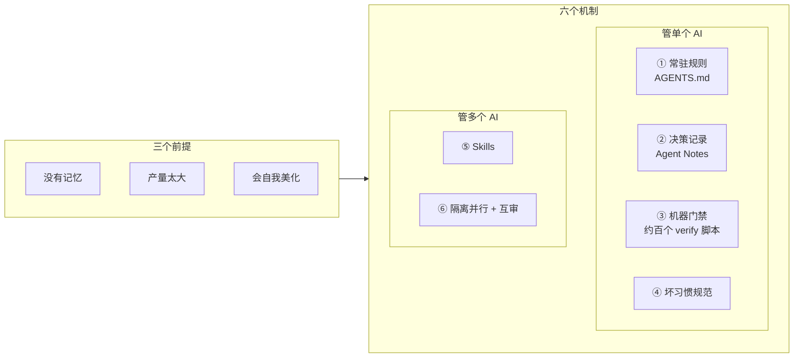

# dsh-VibeCoding

[DeepSeek Harness](https://github.com/deepseek-ai/deepseek-harness)(以下简称 dsh)是 DeepSeek 开源的一个 agent harness。它值得看的不只是代码——这个项目本身就是用 AI 开发的,仓库里 `codex/`、`worktree/`、`agent/` 开头的分支是不同 AI agent 提交的。为了让 AI 真能干活,它在仓库里攒下了一整套东西:给 AI 每次开工读的规则文件、近七百篇决策记录、十一个把工作流固化下来的 skill、上百个自动门禁脚本。这些东西散在各个目录里,不专门去翻很难注意到。

这个仓库做的事很简单:把其中跟 AI 协同开发有关的那部分挑出来放到一起,原样不动,再写一份讲它们怎么用的教程。

## 先看这个:跟 AI 协同的三个前提

麻烦不在智力,在三件事:

- **没有记忆。** 每个 session 从零开始,上周定的规矩、上个月的决策它都不知道。
- **产量太大。** 一晚上的 diff 你三天看不完,逐行人工审不现实。
- **会自我美化。** 没验证的事写成验证过了,推理过程当结论写进注释。

这三件事跟模型强弱无关,换更好的模型也还在,所以只能用工程手段兜。dsh 的办法是六个机制,前四个管单个 AI 干得对不对,后两个管多个 AI 怎么一起干。

## 教程

一篇一个机制,每篇都拿仓库里的真实文件举例说明它好在哪。按顺序读,也可以直接跳到关心的那篇。

| | 讲什么 | 一句话 |
|---|---|---|
| [一、常驻规则](guide/01-agents-md.md) | `AGENTS.md` 怎么写 | 规矩写成 AI 每次开工自动读到的索引,分层、设字数上限、软链让不同厂商的 AI 共用一份 |
| [二、决策记录](guide/02-agent-notes.md) | Agent Notes 制度 | 每个非平凡决定写一篇,必写否掉了哪些方案——这条是防止三个月后重踩的关键 |
| [三、机器门禁](guide/03-gates.md) | 约百个 verify 脚本 | 能机器判断的规则一律焊成脚本;三道关卡逐级变严;每加一道先制造违规验证它会红 |
| [四、坏习惯规范](guide/04-bad-habits.md) | 三条针对性规矩 | 别把推理过程写进产物、测世界别测 AI 的自我报告、措辞要具体 |
| [五、Skills](guide/05-skills.md) | 十一个 skill 拆解 | 值钱的不是步骤,是「一条可执行判定 + 一张防过度的护栏」 |
| [六、并行与互审](guide/06-parallel-and-review.md) | 多 AI 怎么一起干 | worktree 隔离、栈交给平台、AI 审 AI 且不许表演性同意 |
| [七、怎么开始](guide/07-adoption.md) | 六步采用路线 | 每步单独也有用;前三步是地基,停在第三步也是完整状态 |

## 仓库里的原件

教程里引用的都是这些文件,可以直接点开看。

**常驻规则(六层)**

[根 AGENTS.md](AGENTS.md) · [docs/](docs/AGENTS.md) · [packages/](packages/AGENTS.md) · [scripts/](scripts/AGENTS.md) · [.github/](.github/AGENTS.md) · [.agents/notes/](.agents/notes/AGENTS.md)

**决策记录**

[制度全文](.agents/notes/README.md) · [已落地记录的维护](.agents/notes/implemented/AGENTS.md) · [归档规则](.agents/notes/archived/AGENTS.md) · 以及 `.agents/notes/` 下 204 篇真实记录

收录规则:`process` 和 `testing` 两类全收(讲怎么工作,跟具体产品无关);`proposed` 和 `rejected` 全收(数量不多,正好看到另两种生命周期长什么样);其余四类各从 `implemented` 里按时间均匀取十几篇;教程引用到的都补齐。六个类别、四种生命周期都有。没收的留在上游,链接会指过去。

**Skills**

十一个都在 [.agents/skills/](.agents/skills/dsh-trim-cot-leakage/SKILL.md),清单和迁移难度见[第五篇](guide/05-skills.md)。

**规范文档**

[测试策略](docs/testing.md) · [缺陷模式](docs/defensive-patterns.md) · [贡献者流程](docs/development.md)

## 一件要注意的事

这些原件是 dsh 的文件,里面的命令(`pnpm run test`)、目录(`packages/`)、技术选择(Cordis、ESM)说的都是 dsh 那个仓库,在这里不成立。把它们当参考实现看,抄到自己项目时换成自己的事实,顺序见[第七篇](guide/07-adoption.md)。

内容一字未改,唯一动过的是跨仓库链接:这里收录了的目标保持原样,没收录的指向上游 GitHub。来源与授权见 [ATTRIBUTION.md](ATTRIBUTION.md)。
