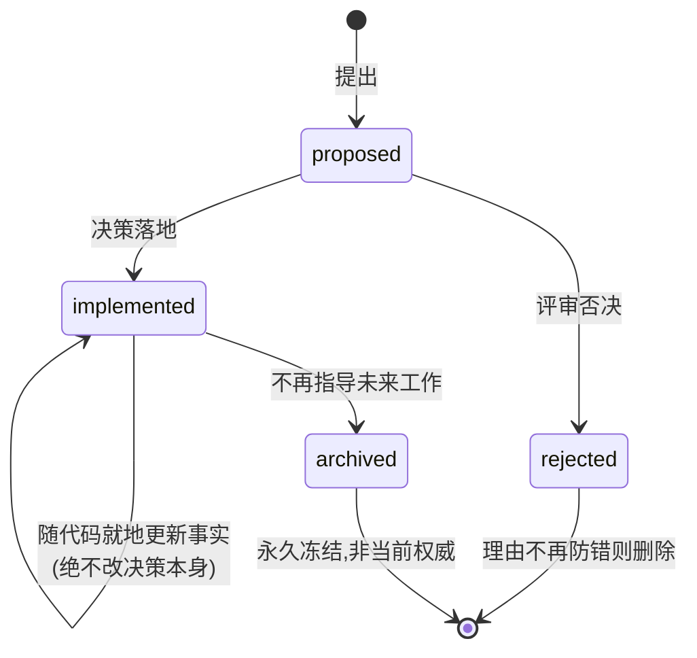
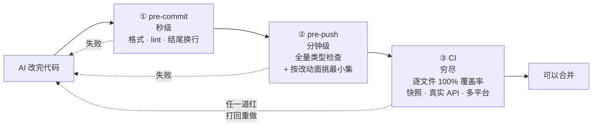
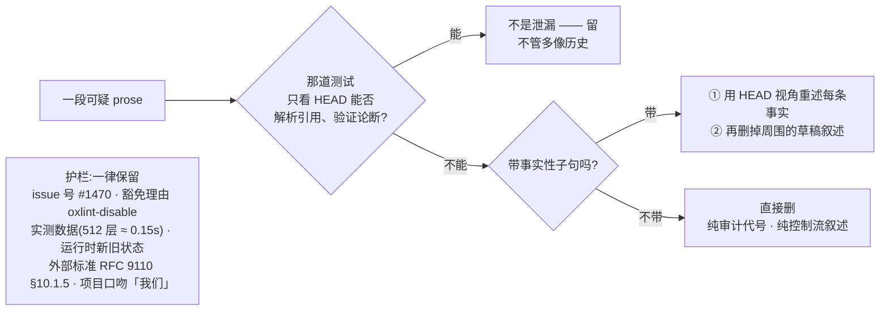
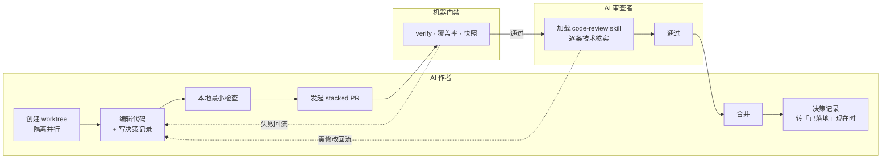

# dsh-VibeCoding

**这个仓库 = [DeepSeek Harness](https://github.com/deepseek-ai/deepseek-harness) 的「人机协同开发」真实工件 + 一篇教学。**

- **工件**:`AGENTS.md`、`.agents/skills/`、`.agents/notes/`、`docs/` 全部是 dsh 的**原样文件**,放在它们**原本的路径**上,一字未改(只修了跨仓库链接)。
- **教学**:就是下面这篇 README,讲清这些工件背后的方法论,以及怎么搬到你自己团队。

> ⚠️ 注意:那些工件描述的是 **dsh 那个仓库**(`pnpm` 命令、`packages/` 布局、Cordis 插件树),不是本仓库。它们是**参考实现**,照抄时要替换成你的项目事实。

---

# 与 AI 协同开发:DeepSeek Harness 工程实践剖析

> **一句话主张:** 不要假设 AI 可靠。把它当成一个「会忘、会滥产、会自欺」的高速贡献者,针对这三个现实各建一套工程机制去兜底 —— AI 就能既高速产出、又始终可控。

DeepSeek Harness 本身就是一个 agent harness(给 AI 跑任务用的框架),而且**用 AI 开发自己**:仓库里能看到 `codex/`、`worktree/`、`agent/` 前缀的分支 —— 不同的 AI agent 在并行提交。所以它的仓库结构本身,就是一套「如何与 AI 协同开发」的可迁移答案。

## 一、核心命题:三个现实,六个机制

和 AI 协同,痛点从来不是「AI 不够聪明」,而是三个结构性现实:

- **会忘**:每个 session 都是白纸,上次的约定、上个月的决策它都不记得。
- **会滥产**:产量远超人工能逐行审阅的速度,靠人肉把关会崩。
- **会自欺**:会编造事实、把推理过程当结论写、自我美化「我测过了」。

为什么是这三个、而不是「能力不足」?因为能力会随模型升级自己变好,而这三个是**架构级**的:换更强的模型,它照样每个 session 从零开始、照样一晚上产出你三天看不完的 diff、照样会把「我觉得对」写成「我验证过」。

所以真正该投入的,不是调教 AI 更聪明,而是**用工程手段把这三个现实兜住**:


前四个是**基础设施**(让单个 AI 干得对),后两个是**协作流程**(让多个 AI 一起干)。下面逐一拆。

## 二、机制①:常驻规则 —— 每个 session 必读的规则索引

**概念.** 一份放在仓库里、AI 每次进入 session 都会**自动读到**的规则文件。它是「常驻上下文」,相当于每次开工前塞给 AI 的一页行为准则。

**为什么有效.** AI 无记忆,你上周立的规矩它这周不记得;但它每个 session 一定会读工程约定文件。三个关键设计:

1. **它是索引不是教程** —— 每条一到两行给结论 + 一个链接,细节留在别处,这样它足够短、能廉价塞进上下文。
2. **分层就近** —— 根目录放通用规则,子目录放该目录专属规则,AI 在哪干活就自动叠加哪层。
3. **厂商中立** —— `CLAUDE.md` 软链到 `AGENTS.md`,Claude Code 读前者、Codex 读后者,**物理上是同一个文件**。这正是 dsh 能同时被多种 AI 开发的前提。

**看真实的:**

| 文件 | 管什么 |
|---|---|
| [AGENTS.md](AGENTS.md) | 根:定位、目录地图、命令表、一大节代码约定 |
| [docs/AGENTS.md](docs/AGENTS.md) | 文档子树:分层、一个事实一个家、字数预算 |
| [packages/AGENTS.md](packages/AGENTS.md) | 包子树:插件导出、服务设计、边界校验 |
| [scripts/AGENTS.md](scripts/AGENTS.md) | 脚本子树 |
| [.github/AGENTS.md](.github/AGENTS.md) | CI / PR 相关 |
| [.agents/notes/AGENTS.md](.agents/notes/AGENTS.md) | 决策记录子树 |

六份 `AGENTS.md` 分层叠加 —— 这就是「分层就近」的实物。

**常见坑.**

- ❌ 写成长篇教程 → AI 读不完也记不住重点。**治:只留结论 + 链接。**
- ❌ 规则只写「做什么」不写「哪里能查为什么」→ AI 照做但不知边界。**治:每条挂一个链接。**
- ❌ 让它无限膨胀 → 每 session 都烧 token 且淹没重点。**治:设字数上限并用脚本卡住**(dsh 给根文件设了约 1600 词)。

## 三、机制②:决策记忆 —— 跨 session 的机构记忆

**概念.** 每做一个非平凡决策,就写一篇持久的**决策记录**(dsh 叫 Agent Note),保住代码和文档承载不了的东西:为什么这么定、放弃了哪些方案、代价是什么。dsh 自己的定义是「**AI 写的 RFC**」,仓库里现在有 **696 篇**。

**为什么有效.** 这是治「会忘」的第二层,也是最关键的一层。AI(和几周后的你)看到某个「怪设计」,第一反应是「这不对,我改了它」——于是一次次推翻已定的东西、重踩已知的坑。决策记录拦在这里说「这个方案我们考虑过,因为某原因否掉了」。

所以**最关键的一条规矩是:每篇必须写「否掉了哪些方案、为什么」**。dsh 一针见血:

> 只记结论、不记「击败了什么」的决策,会招致反复争论 —— 这正是 Agent Notes 要防的失败。

**它的状态会流转,路径本身就编码了状态与类别:**



路径格式 `{生命周期}/{类别}/日期-标题.md`;类别六选一:`feature / bug-fix / simplification / architecture / process / testing`。

**铁律:永不把一篇改成相反的决策** —— 要反悔,新写一篇取代它,两篇互相链接。新增任意一篇都触发「取代检查」:完全被取代的旧记录同 PR 归档,部分取代的两者都保持活跃。

**完整制度(dsh 原文):** [.agents/notes/README.md](.agents/notes/README.md) · [已落地记录怎么保持与现实一致](.agents/notes/implemented/AGENTS.md) · [归档冻结规则](.agents/notes/archived/AGENTS.md)

**四个真实例子(都在讲同一件事:别重踩).**

- **不建中央索引**(`implemented`)—— 696 篇记录,谁都会想「该有个总索引吧」。但这事早有定论、被否了:生成式索引会变成合并热点,而且只是重复了文件路径本已编码的信息,还平添一套生成器要长期维护。结论是用目录树加仓库搜索来发现。于是下一个动念「加个索引」的人,会先撞见这篇,省下一次重造。([原文](https://github.com/deepseek-ai/deepseek-harness/blob/master/.agents/notes/implemented/process/2026-07-19-remove-generated-agent-note-index.md))
- **一次 NIH 审计的「否决清单」**(`rejected`)—— 他们做过一次全仓库审计,对每处手写实现都问一遍「能不能换成成熟三方库?」正面结论各自立项;负面结论被专门冻结成一篇,状态行直接写着「**记录下来,免得整个调研从头再查一遍**」,里面 30 多条逐个写明「这个看起来该换的库,为什么其实换不得」。下次再有人提「换成流行库 Y」,得先驳倒记录在案的那条理由。([原文](https://github.com/deepseek-ai/deepseek-harness/blob/master/.agents/notes/rejected/simplification/2026-07-26-dependency-swaps-rejected-by-nih-audit.md))
- **给会话日志选压缩**(`architecture`)—— 上 Zstandard 压缩,备选方案一口气记了 5 个,其中一条是「加一个外部原生 zstd 依赖」,否掉的理由是「Node 版本底线已自带这个编解码器,再多引一个原生产物只会加大安装和打包风险」。
- **被事故逼出来的守卫**(`bug-fix`)—— Web agent 分不清「哪个 URL 是用户正在看的界面」,而裸跑 `vite` 恰好返回 HTTP 200、看着对、其实注入不了启动数据:**一个错答案伪装成对的**。事故复盘记下时间线,决策记录记下修法:把唯一 URL 变成模型可见 + shell 变量,并让裸 `vite` 的 serve 模式直接报错退出。

## 四、机制③:机器门禁 —— 用检查取代信任

**概念.** 把规则尽量**焊进可执行的脚本**,在提交 / 推送 / CI 时自动跑,而不是指望 AI 记住、也不是指望人肉逐行审。dsh 有约 100 个这类脚本。

**为什么有效.** 这是治「会滥产」的核心。AI 一晚上产出的量,人不可能逐行看完;规则写在文档里,AI 会忘、会漏。门禁把规则变成「不通过就进不去」的硬约束。dsh 的原话:「把可机检的不变量焊进一个会被执行的顶层门禁」。

**三道关卡:越往后越慢、越穷尽。** 快的挡低级错,慢的挡真问题:



**关键纪律:pre-push 不跑全套。** 选恰好覆盖本次改动的最小集合,CI 才负责穷尽覆盖与平台矩阵。参考 [dsh-pre-push-checks](.agents/skills/dsh-pre-push-checks/SKILL.md)。

**值得抄的门禁清单:**

```
□ 类型 / 编译零错误(严格模式)      □ 决策记录格式校验(骨架、必填节)
□ 测试覆盖率(逐文件,非全局平均)   □ 跨文件重复代码检测
□ 文档死链检查                      □ 提交信息 / 文件结尾换行
□ 文档字数上限(防常驻规则膨胀)     □ 导出必须有文档注释
```

**两条最容易把门禁做废的地方:**

1. **加了门禁但从没见它变红** —— 可能是个永远绿的摆设。**治:每加一道,先故意制造一次违规,确认它真的报错,再修回来。**
2. **只在 prompt / schema 层「过滤」当成强制** —— 这是最隐蔽的假安全。dsh 的规则:**「在做决策的那个操作里强制该决策」**,schema 省略、prompt 过滤、facade、wrapper、listener 顺序都**不算**强制,因为旁路调用能绕过;必须在真正执行的那一层测到「拒绝」。

**一个反直觉的用法.** 覆盖率门禁要求逐文件 100%,但态度是:某行没被覆盖,**第一反应不是「补个测试」,而是「这行是不是该删的死代码」**。于是同一道门禁,既逼你补测试、又逼你删废码。同时明确承认边界:**行覆盖是必要条件,永远不是充分条件**。

**完整测试策略(dsh 原文):** [docs/testing.md](docs/testing.md) · **缺陷模式:** [docs/defensive-patterns.md](docs/defensive-patterns.md) · **贡献流程:** [docs/development.md](docs/development.md)

## 五、机制④:治 AI 坏习惯的三条规范

**概念.** 针对 AI 的典型毛病(啰嗦、含糊、自我美化),各立一条**可执行的判定/清理规则**。AI 的坏习惯不是随机的,是**成体系、可预测**的,所以能逐类立规矩去治。

1. **清理「思维链泄漏」** —— AI 爱把推理过程写进注释和文档:`(decision 7)`、`used to / no longer`、「先做 X 再做 Y」。判定就一句话:**「一个只看 HEAD、拿不到任何对话记录的读者,能否解析每个引用、验证每个论断?」**不能就重写。
2. **验证世界,而非自我报告** —— 测试断言必须**重跑命令、重读文件**外部核验,不能探测 AI 自己的输出。否则「会作弊的 agent」靠嘴上说「我测过了」就能蒙混过关。
3. **措辞具体化** —— 禁止隐喻、禁止「gate / surface / shape」这类空词,要求点名具体的检查、类型、操作。

**自查清单:**

```
□ 有没有「(decision N)」「以前/现在/不再」这类只有当时对话才懂的话?→ 删
□ 注释是在陈述契约,还是在复述代码 / 叙述过程?→ 只留契约
□ 测试断言的是「世界的真实状态」,还是 AI 自己的输出?→ 必须外部核验
□ 有没有「某种机制」这类空词能换成具体名字?→ 换
```

## 六、机制⑤:Skills —— 把「判断」而不只是「步骤」固化下来

**概念.** skill 是一份带触发条件的工作流文件,AI 遇到匹配场景就自动加载。但真正值钱的地方**不是「记录了步骤」**——步骤谁都会写。它值钱在:**每个 skill 都焊死了一条「AI 很容易做错、而且做错了当时不易发现」的判断**。

**共性公式:一句可执行的判定 + 一张防过度的护栏。** 护栏那半往往比判定更能体现功力——它拦住的正是「热心 AI 一删到底」。

| Skill(点进去看原文) | 它固化的那条「不显然判断」 | 迁移度 |
|---|---|---|
| [dsh-trim-cot-leakage](.agents/skills/dsh-trim-cot-leakage/SKILL.md) | 「只看 HEAD 的读者能否验证每个论断?」不能就重写 —— **外加九条「什么不算泄漏」的保留规则** | ⭐ |
| [dsh-prose-standard](.agents/skills/dsh-prose-standard/SKILL.md) | 「先枚举命题,再动笔」:每条命题(actor / 条件时序 / must-may-never / 负向保证 / 所有权后果)都要留住;**字数变少本身不是改进** | ⭐ |
| [dsh-code-review](.agents/skills/dsh-code-review/SKILL.md) | 「指南不是清单;一条有据的 blocker 胜过一堆 nits」+ 收到审查**逐条技术核实、可反驳,不许表演性同意** | ⭐ |
| [dsh-find-simplifications](.agents/skills/dsh-find-simplifications/SKILL.md) | 「强候选 vs 水候选」:先把消费者分成生产 / 非生产 / 模糊三类看真实调用点;**双适配器、双后端是有意为之,别当低垂果实删** | ⭐ |
| [dsh-merging-stacked-prs](.agents/skills/dsh-merging-stacked-prs/SKILL.md) | 「让 GitHub 拥有栈语义」:必须用官方栈命令,绝不手工模拟;没官方支持就**硬停** | ⭐ |
| [record-browser-gif](.agents/skills/record-browser-gif/SKILL.md) | GUI 改动必须附**从真实服务与模型流录制**的 GIF,不能用示意图糊过去 | ⭐ |
| [dsh-archive-agent-notes](.agents/skills/dsh-archive-agent-notes/SKILL.md) | 按「未来决策价值」而非字数、年龄、配额决定归档;**提案永不归档**;归档后**永久冻结** | 🔸 |
| [dsh-pre-push-checks](.agents/skills/dsh-pre-push-checks/SKILL.md) | 选**恰好覆盖本次改动**的检查,不无脑跑全套;**只报告实际跑过的命令** | 🔸 |
| [dsh-doc-standards](.agents/skills/dsh-doc-standards/SKILL.md) | 「一个事实一个家」+ 分层字数预算;红了先**搬走**、再**压缩**、最后才**抬上限** | 🔸 |
| [dsh-translate-docs](.agents/skills/dsh-translate-docs/SKILL.md) | 双语对**没有永久主语言**,任一侧都可为本次改动的作者侧 | ⚪ |
| [dsh-doc-site-sync](.agents/skills/dsh-doc-site-sync/SKILL.md) | 站点是仓库文档的**投影**,不是第二份真相 | ⚪ |

⭐ 判断与技术栈无关,直接可用(替换命令即可) · 🔸 需替换成你自己的门禁与目录 · ⚪ 强依赖 dsh 的双语机制/站点结构,仅作模式参考

### 深挖:`dsh-trim-cot-leakage`(dsh 最有特色的一个)

它专治一个几乎没人系统处理过的毛病:**AI 爱把「思考过程」写进最终产物**。

**核心就一句测试:**

> 一个站在 HEAD、拿不到任何会话记录 / PR 讨论 / 未提交草稿的读者,能解析每一个引用、验证每一个论断吗?
> 不能 → 把幸存的事实用仓库视角重述,其余删掉。能 → 它就不是泄漏,不管听起来多像历史。

**它把泄漏归成八类**:①死掉的设计会话引用(`(decision 7)`、阶段代号 `T4`)②栈/PR 视角(「后面那个 PR」)③变更叙述与版本戳(`used to`、`this cut`)④评审编排(「评审时被否」)⑤面向 reviewer 的自辩(「这样写是安全的,因为…」)⑥复述/推导草稿(控制流叙述)⑦对冲与计划残留(「暂时够用」)⑧写作语言串味。

**真正不显然、也最值钱的是它专门列的「什么*不算*泄漏」护栏:**



**为什么这条护栏最值钱:** 一个「热心」的 AI 接到「清理」任务最容易**矫枉过正**——把 issue 号、豁免理由、实测数据一起删了。这个 skill 的精髓不是「删掉像思考的东西」,而是**教 AI 精确区分「过程噪音」和「承重事实」**。

完整八类修法、九条保留规则、五步工作流,以及大量正反例校准,见原文:[SKILL.md](.agents/skills/dsh-trim-cot-leakage/SKILL.md) · [references/examples.md](.agents/skills/dsh-trim-cot-leakage/references/examples.md) · [references/recall-batteries.md](.agents/skills/dsh-trim-cot-leakage/references/recall-batteries.md)

## 七、机制⑥:多 AI 并行 + AI 审 AI

**概念.** 让多个 AI 在**隔离环境**里并行干活,再用 **AI 审 AI** 把关,人做最终裁决。

**为什么有效.** 单个 AI 串行太慢,多个 AI 共享工作区又会互相踩踏;人肉审查所有产出会成为瓶颈。隔离 + 互审同时解决这两点。



**四条做法:**

1. **隔离** —— 每个 AI 一个 git worktree,分支带来源前缀(`codex/`、`worktree/`)。
2. **依赖链** —— 相互依赖的改动用官方 stacked PR([dsh-merging-stacked-prs](.agents/skills/dsh-merging-stacked-prs/SKILL.md))。
3. **AI 审 AI** —— 审查者加载 [dsh-code-review](.agents/skills/dsh-code-review/SKILL.md),拿整套仓库标准来审;硬规矩:**逐条核实、技术层面修复或反驳,不许表演性同意**。
4. **合并即回填记忆** —— PR 实现了某个提案,同一改动里把对应记录从「提案」改写成「已发布」的现在时。

## 八、从零搭建:六步采用路线

不必一次上全套。每步都能独立见效:

| 步 | 做什么 | 治哪个现实 | 见效 |
|---|---|---|---|
| 1 | 立 `AGENTS.md` + 软链 `CLAUDE.md`(抄 [AGENTS.md](AGENTS.md) 的骨架,换成你的事实) | 会忘 | 当天 |
| 2 | 决策记录规矩:非平凡改动配一篇,**必写「否掉了什么」**(照 [.agents/notes/README.md](.agents/notes/README.md)) | 会忘 | 一周 |
| 3 | 焊两三道门禁:类型检查 → 一条常犯格式问题 → 决策记录格式校验 | 会滥产 | 一周 |
| 4 | 列 AI 坏习惯清单,先写进 `AGENTS.md` | 会自欺 | 立即 |
| 5 | 高频活做成 skill,每个焊一条「不显然判断」 | 质量不飘 | 一月 |
| 6 | 多 AI 隔离并行 + 互审 | 协作放大 | 规模上来再上 |

**顺序不是随意排的:**

- **前三步是地基** —— 没有常驻规则,写了 skill 也没人遵守(AI 不知道该加载它);没有决策记录,门禁会被当成「碍事的东西」绕开。
- **后三步靠前三步撑** —— skill 里的判断要能引用规则和记录;多 AI 互审要有统一标准可依,否则只是多了几个吵架的人。

停在第 3 步也是一个完整可用的状态。

## 九、一页速查

1. 建 `AGENTS.md`(软链 `CLAUDE.md`),每 session 喂给 AI;只放结论 + 链接,设字数上限。
2. 强制决策记录:每个非平凡改动配一篇,**必写「否掉了什么方案」**。
3. 规则能焊成脚本就别只写文档 —— 让门禁去挡,并**先制造违规验证它会红**。
4. 测试**验证世界、不验证 AI 的自我报告**(重跑命令、重读文件)。
5. 列一张 AI 坏习惯清单,为每类配一条清理规则。
6. 把重复工作流固化成带触发条件的 skill,每个焊一条**判断 + 护栏**。
7. 多 AI 隔离并行 + 互相审查;审查时要求技术核实、**不许表演性同意**。

## 十、一句话总结

> 不赌 AI 可靠,而是假设它会忘、会滥产、会自欺,然后用「常驻规则 + 决策记忆 + 机器门禁 + 坏习惯规范 + 判断固化 + 隔离互审」六个机制逐一兜住。人类退到掌舵、拍板、审 PR 的位置,AI 在护栏内高速奔跑。

---

## 仓库里有什么

```
AGENTS.md                根:定位 · 目录地图 · 命令 · 代码约定(CLAUDE.md 软链到它)
docs/AGENTS.md           文档子树规则:分层、一个事实一个家、字数预算
packages/AGENTS.md       包子树规则:插件导出、服务设计、边界校验
scripts/AGENTS.md        脚本子树规则
.github/AGENTS.md        CI / PR 规则
.agents/
  notes/AGENTS.md        决策记录子树规则
  notes/README.md        决策记录制度全文:生命周期、分类、格式、取代规则
  notes/implemented/AGENTS.md   已落地记录怎么与现实保持一致
  notes/archived/AGENTS.md      归档冻结规则
  skills/                11 个 skill 全套(含 references / scripts)
docs/testing.md          测试策略:分层、真实入口、验证世界而非自我报告
docs/defensive-patterns.md  生命周期 / 并发 / 子进程 / teardown 缺陷模式
docs/development.md      贡献者流程:环境、工作流、CI 组织、TODO 标记语义
LICENSE                  MIT(Copyright (c) 2026 DeepSeek)
```

**全部是 dsh 原文,一字未改**,唯一的改动是跨仓库链接:本库已收录的目标原样保留(120 处),未收录的指向上游 GitHub(112 处,涉及 77 个上游文件),读者仍可点进去读原始内容。

来源与授权详见 [ATTRIBUTION.md](ATTRIBUTION.md)。
