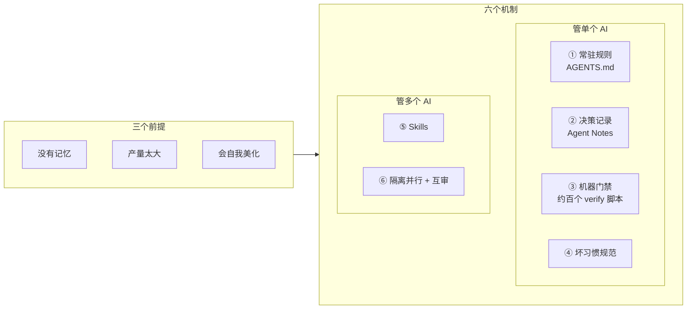
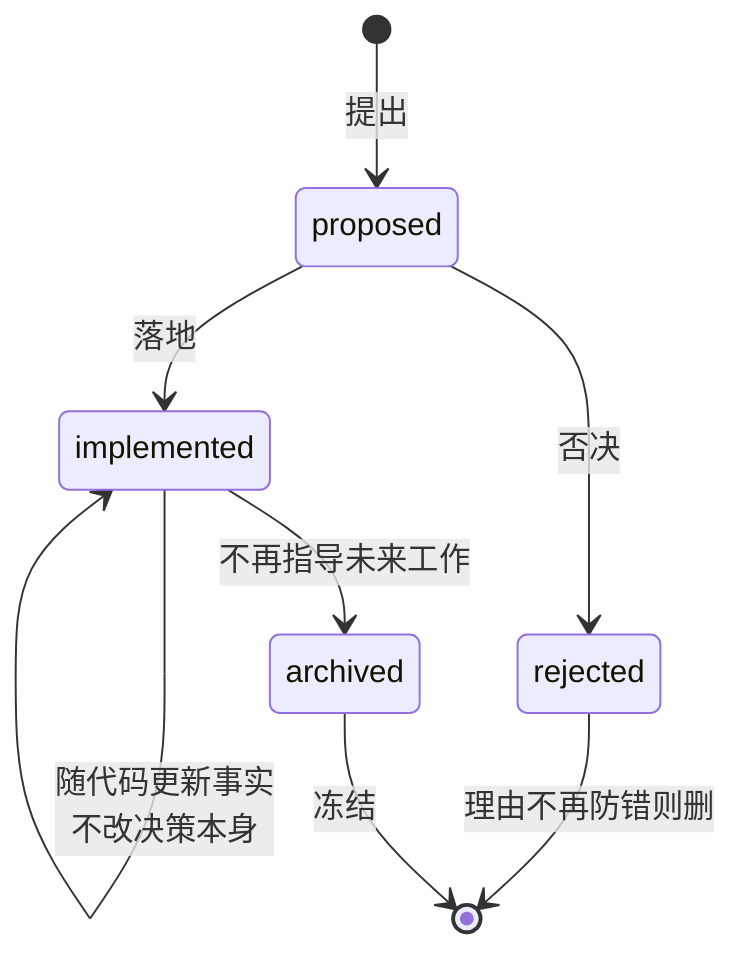
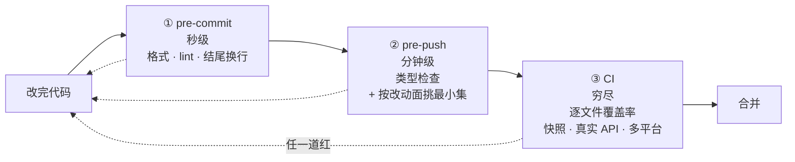
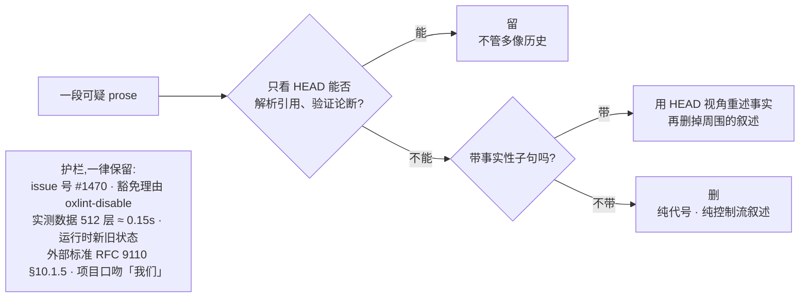
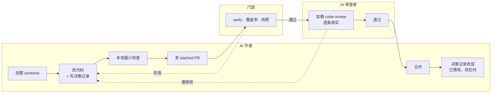

# dsh-VibeCoding

这个仓库收了两样东西:[DeepSeek Harness](https://github.com/deepseek-ai/deepseek-harness)(下面简称 dsh)跟 AI 协同开发用的那套文件,和一篇讲这些文件怎么用的文章——文章就是下面的正文。

那套文件具体指:给 AI 每次开工前读的规则(`AGENTS.md`,分六层)、决策记录制度和 132 篇真实记录、11 个把工作流固化下来的 skill,以及测试策略、缺陷模式、贡献流程三份规范。清单见[最后一节](#仓库内容)。

dsh 是 DeepSeek 开源的 agent harness,它也用 AI 开发自己:仓库里 `codex/`、`worktree/`、`agent/` 开头的分支是不同 AI agent 提的。所以这套文件是实际在用的东西,不是为了演示写出来的。

有一点读之前要知道:这些文件是 dsh 的原件,里面的命令(`pnpm run test`)、目录(`packages/`)、技术选择(Cordis、ESM)说的都是 dsh 那个仓库,在这里不成立。把它们当参考实现看,抄到自己项目时换成自己的事实,顺序见[第七节](#七怎么开始)。

---

## 三个前提

跟 AI 协同的麻烦不在智力,在三件事:

- **没有记忆。** 每个 session 从零开始,上周定的规矩、上个月的决策它都不知道。
- **产量太大。** 一晚上的 diff 你三天看不完,逐行人工审不现实。
- **会自我美化。** 没验证的事写成验证过了,推理过程当结论写进注释。

这三件事跟模型强弱无关,换更好的模型也还在,所以只能用工程手段兜。dsh 的办法是六个机制,前四个管单个 AI 干得对不对,后两个管多个 AI 怎么一起干。



## 一、常驻规则:AGENTS.md

AI 每进一个 session 都会读仓库里的约定文件。把规矩写进这个文件,就等于每次开工前都递给它一份。

三个设计上的取舍值得注意。

第一,它是索引不是教程。每条规则一两行给结论,后面挂一个链接,细节放在别处。这样文件够短,塞进上下文成本低。dsh 给根文件设了约 1600 词的上限并用脚本卡住,因为它每个 session 都占上下文,膨胀了既费钱又淹没重点。

第二,分层。根目录一份通用的,子目录各放一份该目录专属的,AI 在哪干活就叠加哪层。这个仓库里有六份:

| 文件 | 管什么 |
|---|---|
| [AGENTS.md](AGENTS.md) | 根:定位、目录地图、命令表、代码约定 |
| [docs/AGENTS.md](docs/AGENTS.md) | 文档:分层、一个事实一个家、字数预算 |
| [packages/AGENTS.md](packages/AGENTS.md) | 包:插件导出、服务设计、边界校验 |
| [scripts/AGENTS.md](scripts/AGENTS.md) | 脚本 |
| [.github/AGENTS.md](.github/AGENTS.md) | CI 与 PR |
| [.agents/notes/AGENTS.md](.agents/notes/AGENTS.md) | 决策记录 |

第三,不绑定厂商。`CLAUDE.md` 软链到 `AGENTS.md`,Claude Code 读前者、Codex 读后者,物理上同一个文件。dsh 能同时被几种 AI 开发,靠的就是这个。

## 二、决策记录:Agent Notes

每做一个非平凡的决定,写一篇记录,把代码和文档装不下的东西留住:为什么这么定、放弃了哪些方案、代价是什么。dsh 管这叫「AI 写的 RFC」,现在有 696 篇。

这里面最要紧的一条规矩是每篇都必须写清否掉了哪些方案。dsh 的原话:

> 只记结论、不记「击败了什么」的决策,会招致反复争论 —— 这正是 Agent Notes 要防的失败。

用处很具体。AI 或者几周后的你看到某个奇怪的设计,第一反应通常是改掉它;记录摆在那里,说这个方案考虑过、因为某个原因否了。

记录的状态会变,路径本身就编码了状态和类别:



路径是 `{生命周期}/{类别}/日期-标题.md`,类别六选一:`feature`、`bug-fix`、`simplification`、`architecture`、`process`、`testing`。

有条硬规矩:不能把一篇记录改成相反的决定。要反悔就新写一篇取代它,两篇互相链接。每次新增记录都要顺手查一遍有没有旧记录被它取代了。

制度全文在 [.agents/notes/README.md](.agents/notes/README.md),配套的还有[已落地记录怎么跟现实保持一致](.agents/notes/implemented/AGENTS.md)和[归档规则](.agents/notes/archived/AGENTS.md)。

仓库里放了 132 篇真实记录:`process` 和 `testing` 两类全收(讲怎么工作的,跟具体产品无关),加上本仓库引用到的和下面举例的。四种生命周期都有。其余按类别归属留在上游,链接会指过去。

### 四个例子

**不建中央索引**(`implemented`)。696 篇记录,想加个总索引是很自然的念头。但这事早有定论、被否了:生成的索引会成为合并冲突热点,内容又只是重复文件路径已有的信息,还多一套生成器要养。结论是靠目录树和搜索来找。下一个动这个念头的人会先撞见这篇。[原文](.agents/notes/implemented/process/2026-07-19-remove-generated-agent-note-index.md)

**一次依赖审计的否决清单**(`rejected`)。他们把全仓库的手写实现过了一遍,问每一处能不能换成成熟的三方库。能换的各自立项,不能换的三十多条集中冻结成一篇,状态行写着「记录下来,免得整个调研从头再查一遍」,逐条说明这个看起来该换的库为什么其实换不得。下次有人再提换库,得先驳倒记录在案的理由。[原文](.agents/notes/rejected/simplification/2026-07-26-dependency-swaps-rejected-by-nih-audit.md)

**给会话日志选压缩**(`architecture`)。上 Zstandard,备选方案记了五个。其中「加一个外部原生 zstd 依赖」被否的理由是 Node 版本底线已经自带这个编解码器,再引一个原生产物只会加大安装和打包的风险。

**事故之后加的守卫**(`bug-fix`)。Web agent 分不清哪个 URL 是用户正在看的页面,而直接跑 `vite` 会返回 200,看着是对的,其实注入不了启动数据——一个假装正确的错答案。复盘记时间线,决策记录记修法:把唯一 URL 变成模型可见并写进 shell 变量,同时让 `vite` 的 serve 模式直接报错退出。

## 三、机器门禁

规则写在文档里,AI 会漏,人也审不完。能机器判断的就写成脚本,在提交、推送、CI 三处自动跑。dsh 有大约一百个这类脚本。

三道关卡各管一段,越往后越慢也越全:



pre-push 那一步刻意不跑全套,只挑恰好覆盖本次改动的检查,穷尽覆盖和平台矩阵交给 CI。选法见 [dsh-pre-push-checks](.agents/skills/dsh-pre-push-checks/SKILL.md)。

可以直接拿去用的门禁:

```
类型 / 编译零错误              决策记录格式校验
测试覆盖率(逐文件而非平均)     跨文件重复代码检测
文档死链检查                   提交信息 / 结尾换行
文档字数上限                   导出必须有文档注释
```

有两个地方容易让门禁变成摆设。

一个是加了之后从没见它红过——可能正则写错、路径不对,或者压根没被执行。办法是每加一道就故意制造一次违规,确认它真的报错,再改回来。

另一个是把 prompt 或 schema 层的过滤当成了强制。dsh 的规则是强制要落在真正做决定的那个操作里:schema 省略、prompt 过滤、facade、wrapper、listener 顺序都不算,因为绕过它们的调用路径存在;要在执行层测到拒绝。

覆盖率门禁那条要求逐文件 100%,但配套的态度值得一提:某行没被覆盖,先想它是不是该删的死代码,而不是急着补测试。同时它明确写着行覆盖是必要条件而非充分条件——只证明代码跑过,不证明功能是对的。

测试策略全文在 [docs/testing.md](docs/testing.md),缺陷模式在 [docs/defensive-patterns.md](docs/defensive-patterns.md),贡献流程在 [docs/development.md](docs/development.md)。

## 四、针对 AI 坏习惯的规范

AI 的毛病是有规律的,所以能一类一类立规矩。dsh 立了三条。

**别把推理过程写进产物。** `(decision 7)`、`used to / no longer`、「先做 X 再做 Y」这类东西,写的时候读得懂,三个月后是噪音。判定标准是:一个只看 HEAD、拿不到任何对话记录的读者,能不能解析每个引用、验证每个论断。

**测世界,别测 AI 自己的报告。** 断言要重跑命令、重读文件来外部核验。如果靠关键词探测 AI 的输出,一个会作弊的 agent 说一句「我测过了」就能过。

**措辞要具体。** 不用隐喻,不用「gate」「surface」这类空词,点名具体的检查、类型、操作。

自查的时候看四条:

```
有没有只有当时对话才懂的引用?
注释是在说契约,还是在复述代码?
断言的是外部状态,还是 AI 的输出?
有没有空词可以换成具体名字?
```

## 五、Skills

skill 是带触发条件的工作流文件,AI 遇到匹配的场景自己加载。dsh 的 skill 值钱的地方不是记了步骤——步骤谁都会写——而是每个都焊死了一条 AI 容易做错、且做错了当时看不出来的判断。

看下来它们有个共同形状:一条能直接执行的判定,配一张防止做过头的护栏。护栏那半经常比判定更难写。

| Skill | 焊死的那条判断 | 迁移 |
|---|---|---|
| [dsh-trim-cot-leakage](.agents/skills/dsh-trim-cot-leakage/SKILL.md) | 只看 HEAD 的读者能否验证每个论断,不能就重写;附九条「什么不算泄漏」 | 直接可用 |
| [dsh-prose-standard](.agents/skills/dsh-prose-standard/SKILL.md) | 改之前先枚举这段的每条命题,逐条都留住才算改好;字数变少不算改进 | 直接可用 |
| [dsh-code-review](.agents/skills/dsh-code-review/SKILL.md) | 指南不是清单,一条有据的 blocker 胜过一堆 nits;收到审查逐条技术核实、可反驳,不要表演性同意 | 直接可用 |
| [dsh-find-simplifications](.agents/skills/dsh-find-simplifications/SKILL.md) | 动手删之前先把消费者分成生产、非生产、模糊三类看真实调用点;双适配器和双后端是有意为之 | 直接可用 |
| [dsh-merging-stacked-prs](.agents/skills/dsh-merging-stacked-prs/SKILL.md) | 栈语义交给 GitHub,不手工逐个 merge 加 retarget 去模拟;没有官方支持就停 | 直接可用 |
| [record-browser-gif](.agents/skills/record-browser-gif/SKILL.md) | GUI 改动附的 GIF 必须录自真实服务和模型流 | 直接可用 |
| [dsh-archive-agent-notes](.agents/skills/dsh-archive-agent-notes/SKILL.md) | 按未来决策价值决定归档,不按字数年龄配额;提案不归档,过时就否决 | 换命令 |
| [dsh-pre-push-checks](.agents/skills/dsh-pre-push-checks/SKILL.md) | 挑恰好覆盖改动的检查;只报告实际跑过的命令 | 换命令 |
| [dsh-doc-standards](.agents/skills/dsh-doc-standards/SKILL.md) | 一个事实一个家;字数超了先搬走、再压缩,最后才抬上限 | 换分层 |
| [dsh-translate-docs](.agents/skills/dsh-translate-docs/SKILL.md) | 双语对没有永久主语言,哪边先改哪边就是这次的作者侧 | 仅参考 |
| [dsh-doc-site-sync](.agents/skills/dsh-doc-site-sync/SKILL.md) | 站点是文档的投影,不是第二份真相 | 仅参考 |

后两个强依赖 dsh 的双语配对机制和 VitePress 结构,当模式看就好。

### 看一个具体的:dsh-trim-cot-leakage

它治的是 AI 把思考过程写进最终产物,判定只有一句:

> 一个站在 HEAD、拿不到任何会话记录、PR 讨论、未提交草稿的读者,能解析每一个引用、验证每一个论断吗?
> 不能,就把幸存的事实用仓库视角重述,其余删掉。能,它就不是泄漏,不管听起来多像历史。

泄漏被归成八类:死掉的设计会话引用(`(decision 7)`、阶段代号 `T4`)、栈和 PR 视角(「后面那个 PR」)、变更叙述和版本戳(`used to`、`this cut`)、评审编排(「评审时被否」)、面向 reviewer 的自辩(「这样写是安全的,因为…」)、复述和推导草稿、对冲与计划残留(「暂时够用」)、写作语言串味。每类给了各自的修法。

比判定更难写的是那张护栏,列出哪些看着像泄漏但必须留:



这张护栏解决的是一个真问题:AI 接到「清理」这种任务,很容易连 issue 号、豁免理由、实测数据一起删掉。判定告诉它删什么,护栏告诉它哪些是承重的。

完整的八类修法、九条保留规则、五步工作流和大量校准例子在原文:[SKILL.md](.agents/skills/dsh-trim-cot-leakage/SKILL.md)、[examples.md](.agents/skills/dsh-trim-cot-leakage/references/examples.md)、[recall-batteries.md](.agents/skills/dsh-trim-cot-leakage/references/recall-batteries.md)。

## 六、多个 AI 并行,互相审

一个 AI 串行太慢,几个 AI 共享工作区会互相覆盖,全靠人审又卡在人身上。dsh 的组合是隔离加互审。



具体四条:每个 AI 一个 git worktree,分支带来源前缀,所以仓库里能看到 `codex/`、`worktree/`;相互依赖的改动用官方 stacked PR 串,不手工模拟;审查者加载 [dsh-code-review](.agents/skills/dsh-code-review/SKILL.md) 拿整套标准来审,并且收到意见要逐条核实、可以技术反驳,不许一味附和;PR 实现了某个提案,同一次改动里把那篇记录改写成已落地的现在时。

## 七、怎么开始

六步,每步单独也有用。

| 步 | 做什么 | 对应前提 | 多久见效 |
|---|---|---|---|
| 1 | 写 `AGENTS.md`,软链 `CLAUDE.md` | 没有记忆 | 当天 |
| 2 | 定决策记录规矩,必写否掉了什么 | 没有记忆 | 一周 |
| 3 | 焊两三道门禁:类型检查、一条常犯的格式问题、决策记录格式 | 产量太大 | 一周 |
| 4 | 把 AI 坏习惯清单写进 `AGENTS.md` | 会自我美化 | 立即 |
| 5 | 高频的活做成 skill,每个焊一条判断 | 质量不稳 | 一个月 |
| 6 | 多 AI 隔离并行加互审 | 协作 | 规模上来再说 |

顺序有依赖关系。前三步是地基:没有常驻规则,写了 skill 也没人知道该加载;没有决策记录,门禁会被当成碍事的东西绕开。后三步靠前三步撑:skill 里的判断要能引用规则和记录,多 AI 互审要有共同标准可依。

停在第三步也是个能用的状态。

---

## 仓库内容

```
AGENTS.md                根规则,CLAUDE.md 软链到它
docs/AGENTS.md           文档规则
packages/AGENTS.md       包规则
scripts/AGENTS.md        脚本规则
.github/AGENTS.md        CI 与 PR 规则
.agents/
  notes/AGENTS.md        决策记录子树规则
  notes/README.md        决策记录制度全文
  notes/implemented/AGENTS.md   已落地记录的维护规则
  notes/archived/AGENTS.md      归档规则
  notes/**/*.md          132 篇真实决策记录(process + testing 全收)
  skills/                11 个 skill,含 references 与 scripts
docs/testing.md          测试策略
docs/defensive-patterns.md  生命周期、并发、子进程、teardown 的缺陷模式
docs/development.md      贡献者流程、CI 组织、TODO 标记语义
LICENSE                  MIT,Copyright (c) 2026 DeepSeek
```

以上都是 dsh 原文,内容未改。唯一动过的是跨仓库链接:这里收录了的目标保持原样,没收录的指向上游 GitHub,点进去能看到原始内容。

来源和授权见 [ATTRIBUTION.md](ATTRIBUTION.md)。
