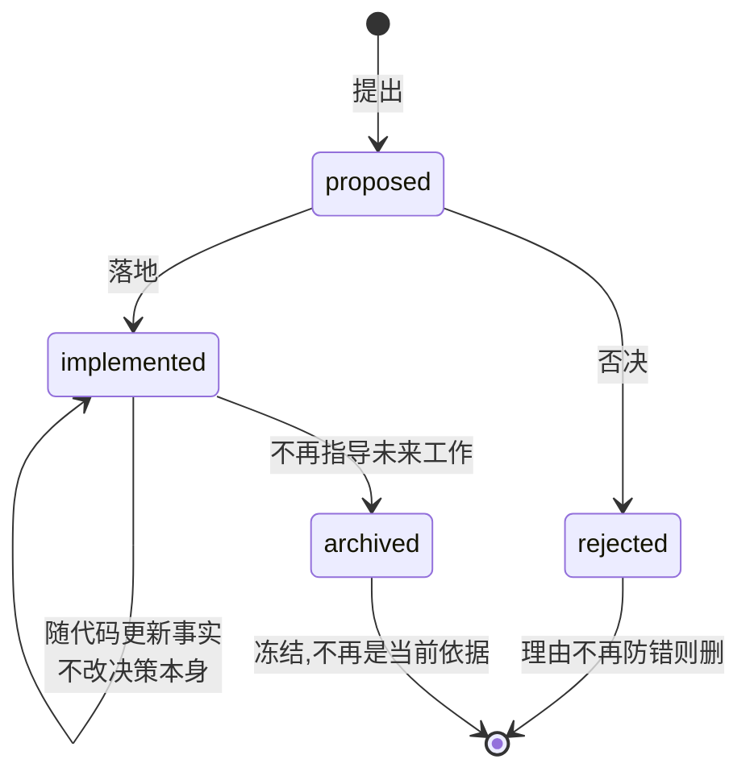

# 二、决策记录:Agent Notes

## 不做会怎样

三个月前你和 AI 一起定了个方案,当时权衡过三种做法,选了看起来最绕的那个,因为另外两个有坑。

三个月后,另一个 AI(或者你自己)看到这段代码,第一反应是「这写得真绕,我改简单点」。于是坑被重新踩一遍。

代码能表达「现在是什么」,表达不了「为什么不是别的样子」。

## dsh 怎么做

每做一个非平凡的决定,写一篇记录,放进 `.agents/notes/`。dsh 管这个叫「AI 写的 RFC」,现在有 696 篇。

最要紧的一条规矩是**每篇必须写清否掉了哪些方案、为什么**。dsh 的原话:

> 只记结论、不记「击败了什么」的决策,会招致反复争论 —— 这正是 Agent Notes 要防的失败。

制度全文在 [.agents/notes/README.md](../.agents/notes/README.md)。

### 路径就是状态

文件路径格式是 `{生命周期}/{类别}/日期-标题.md`,所以看一眼路径就知道这条决策处在什么状态、属于哪一类:



类别六选一:`feature`、`bug-fix`、`simplification`、`architecture`、`process`、`testing`。

还有条硬规矩:**不能把一篇记录改成相反的决定**。要反悔就新写一篇取代它,两篇互相链接。已落地的记录可以随代码更新事实(路径变了、默认值改了),但不能翻转结论,见[已落地记录的维护规则](../.agents/notes/implemented/AGENTS.md)。

## 四个真实例子

这四篇都在仓库里,可以直接点开看。

### 不建中央索引

696 篇记录,想加个总索引是很自然的念头。这事早有定论、被否了。

理由在 [2026-07-19-remove-generated-agent-note-index.md](../.agents/notes/implemented/process/2026-07-19-remove-generated-agent-note-index.md):生成的索引会变成合并冲突热点——任何一个分支新增、改名、移动一篇不相关的记录,都要重写同一个文件;而它的内容只是重复了文件路径本已编码的信息;还多一套生成器、渲染器、命令、时效检查要养。结论是靠目录树和搜索来找。

**好在哪。** 这个念头很容易再次出现,而且看起来完全合理。有了这篇,下一个人会先撞见它,然后要么被说服,要么拿出比「合并热点」更强的理由。省下的是一次完整的重造加一次撤销。

### 一次依赖审计的否决清单

dsh 做过一次全仓库审计,对每处手写实现都问一遍:有没有成熟的三方库能替掉它?能替的各自立项,不能替的三十多条集中冻结成一篇:[2026-07-26-dependency-swaps-rejected-by-nih-audit.md](../.agents/notes/rejected/simplification/2026-07-26-dependency-swaps-rejected-by-nih-audit.md)。

它的状态行写得很直白:

> Status: rejected — every swap below fails the net-simplification bar on evidence; recorded so the survey is not re-run from scratch

里面逐条写明某个看起来该换的库为什么其实换不得。比如「用 `vscode-jsonrpc` 替掉 LSP 协议框架」这条,理由是:可替换的核心只有约 255 行(总共约 1800 行),而那个库无法表达已配置的入站大小上限、把取消时的拆除语义反了、遇到真实服务器在协议头之前输出的 banner 会直接报错,而且它是 CJS 而这个仓库全是 ESM。

**好在哪。** 「把手写的换成成熟库」是每个人都会提的建议,而且通常是对的。这篇把「已经查过、这几条不行」变成了可引用的事实。它明确写着下次要提某一条,得先驳倒记录在案的理由,而不是重新引用一遍政策。

### 给会话日志选压缩

[2026-07-19-zstandard-jsonl-session-logs.md](../.agents/notes/implemented/architecture/2026-07-19-zstandard-jsonl-session-logs.md) 记了五个被否的方案。其中一条是「加一个外部原生 zstd 依赖」,否掉的理由是 Node 版本底线已经自带这个编解码器,再引一个原生产物只会加大安装和可执行文件打包的风险。

**好在哪。** 这个决定的表面结果只是「用了内置的 zstd」,看代码完全看不出还有过选择。有了记录,下次有人想换成某个性能更好的原生库,会知道当初是为了打包风险才不用的。

### 事故之后加的守卫

[2026-07-28-web-gui-feedback-loop.md](../.agents/notes/implemented/bug-fix/2026-07-28-web-gui-feedback-loop.md):Web agent 分不清哪个 URL 是用户正在看的页面,而直接跑 `vite` 会返回 HTTP 200——看着是对的,其实注入不了启动数据。一个假装正确的错答案。

修法是把唯一的 URL 变成模型可见的信息并写进 shell 变量,同时让 `vite` 的 serve 模式在开端口之前就报错退出。

**好在哪。** 这里有个细节:光删掉 `package.json` 里那个开发脚本不够,因为 `npx vite` 绕过脚本照样能跑,而那正是事故当时用的命令。所以必须让 serve 模式本身失败。这类「哪种修法才算真修好」的判断,只有当时查过的人知道,写下来别人才能继承。

## 制度自己也有记录

值得单独提一句:决策记录制度本身的每条规则,也都有对应的记录。

- 固定格式与它否掉的替代方案:[uniform-agent-note-format](../.agents/notes/implemented/process/2026-07-05-uniform-agent-note-format.md)
- 六个类别怎么划、为什么没有 `refactor` 这一类:[agent-note-classification](../.agents/notes/implemented/process/2026-06-20-agent-note-classification.md)
- 归档后为什么永久冻结:[frozen-agent-note-archive](../.agents/notes/implemented/process/2026-07-26-frozen-agent-note-archive.md)

**好在哪。** 制度是最容易被临时放宽的东西——赶时间的时候「这次就不写记录了」特别有说服力。制度自己有记录,意味着放宽它也得先驳倒记录。

## 搬到自己项目

1. 建目录树:`{proposed,implemented,rejected}/{feature,bug-fix,simplification,architecture,process,testing}/`。
2. 在 `AGENTS.md` 里加一条:非平凡改动同一个 PR 至少配一篇记录,必写否掉了哪些方案。
3. 定个固定骨架,写个脚本校验(骨架在下面)。
4. 落地时把提案改写成现在时的已落地状态,不是只改个状态字段。

骨架:

```markdown
# Agent Note: <动作导向的标题>

Status: implemented

## Problem
<动机。脱离解决方案也能读懂>

## Decision
<现在时,描述已经落地的事实>

## Alternatives considered
**方案 A** —— 为什么输了。
**方案 B** —— 为什么输了。

## Consequences
<付出了什么,又换来了什么>
```

## 容易做错的地方

**只写结论。** 「我们决定用 X」——三个月后有人提「不如用 Y」,你没有任何东西可以引用。备选方案那一节是整篇的价值所在。

**把旧记录改成新决定。** 历史就此消失,而且看不出曾经反悔过。要反悔就新写一篇。

**记录和现实脱节。** 代码里路径改了、默认值换了,记录还写着旧的,下一个人照着记录去找会找不到。dsh 要求在同一次改动里就地更新事实。

**攒着不写。** 这套东西的价值随篇数增长,但门槛在第一篇。从下一个非平凡决定开始写就行。

---

上一篇:[常驻规则](01-agents-md.md) · 下一篇:[机器门禁](03-gates.md)
