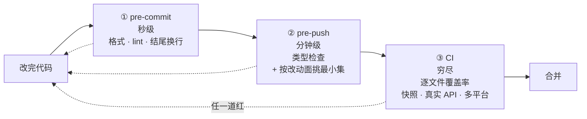

# 三、机器门禁:用检查取代信任

## 不做会怎样

AI 一晚上能产出你三天看不完的 diff。你可以要求它「提交前自己检查一遍」,它会说检查过了。但它说的和它做的是两件事,而你没有办法逐行核对。

规则写在 `AGENTS.md` 里能提高遵守率,提高不到 100%。缺的那部分,越到后期越贵。

## dsh 怎么做

能机器判断对错的规则,一律写成脚本自动跑。dsh 的 `scripts/` 目录下有大约一百个这类脚本,命名统一以 `verify-` 开头。根 `AGENTS.md` 里那句话说得很直接:

> Wire mechanically checkable invariants into an executed top-level gate.

关键词是 **executed**——写了但没被任何流程调用的检查等于不存在。

### 三道关卡,各管一段



越往后越慢也越全。快的挡低级错,慢的挡真问题。

**pre-push 刻意不跑全套。** 根 `AGENTS.md` 里的原话是「Never default to the full suite」,只挑恰好覆盖本次改动的检查,穷尽覆盖和平台矩阵交给 CI。挑选办法固化成了一个 skill:[dsh-pre-push-checks](../.agents/skills/dsh-pre-push-checks/SKILL.md)。

**好在哪。** 本地全跑一遍要十几分钟,跑三次就没人愿意跑了,然后大家开始 `--no-verify`。把本地那道压到分钟级,它才会真的被执行。这个取舍有记录:[parallel-pre-push-gates](../.agents/notes/implemented/process/2026-07-06-parallel-pre-push-gates.md),里面还记了它为什么接受一个自制调度器而不用现成的任务编排工具。

### 有哪些门禁值得抄

dsh 的门禁清单和取舍在 [quality-gates](../.agents/notes/implemented/process/2026-06-11-quality-gates.md) 这篇记录里。可以直接搬的:

```
类型 / 编译零错误              决策记录格式校验
测试覆盖率(逐文件而非平均)     跨文件重复代码检测
文档死链检查                   提交信息 / 结尾换行
文档字数上限                   导出必须有文档注释
```

「文档死链检查」和「文档字数上限」这两条专门服务于前两篇讲的机制:前者保证 `AGENTS.md` 里那些链接不会烂掉,后者防止它膨胀。**机制之间是互相支撑的**——没有门禁,前两个机制会慢慢腐化。

## 两个真实的坑

### 加了门禁,但从没见它红过

一道从未失败的门禁可能只是个摆设:正则写错、路径不对,或者根本没被任何流程调用。

dsh 的 [dsh-code-review](../.agents/skills/dsh-code-review/SKILL.md) 里把这条写成了审查要求:

> A guard only guards if the regression actually fails it. … add an explicit assertion, and prove it: introduce the regression, watch red, revert.

翻译过来就是:**引入回归、看它变红、再撤销**,三步做完才算这道门禁存在。

**好在哪。** 这条要求的成本是几分钟,收益是避免「我们有覆盖」这种错觉。测试策略里还举了具体场景:对一个没有 `inject` 的插件,Loader 冒烟测试在「默认导出替换了必需的具名导出」时仍然会绿——因为它压根没检查这件事。所以要额外加一条 `expect('default' in mod).toBe(false)`,并且证明它在回归时会失败。

### 把 prompt 或 schema 层的过滤当成了强制

这是最隐蔽的一种。AI 很容易写出「看起来限制住了、其实绕得过」的代码:在工具的 JSON schema 里不暴露某个字段,或者在 prompt 里叮嘱模型别那么做。

[packages/AGENTS.md](../packages/AGENTS.md) 里的规则:

> **Enforce a decision in the operation that makes it.** Schema omission, prompt filtering, facades, wrappers, and listener order are not enforcement when direct or alternate callers can bypass them; test denial through the executor.

**好在哪。** 前面那篇 `vite` 的例子就是同一类问题的另一面:删掉 `package.json` 里的脚本不算修好,因为 `npx vite` 绕过脚本。判断标准是「有没有别的调用路径能到达同一个操作」,而不是「主路径上是否被拦住」。

## 覆盖率门禁的一个反直觉用法

dsh 要求 `packages/*/src` **逐文件 100%** 覆盖率,但配套的态度写在 [docs/testing.md](../docs/testing.md) 里:

> An uncovered line is often dead code the gate is correctly flagging for deletion, not a missing test to bolt on.

某行没被覆盖,先想它是不是该删,而不是急着补个测试把它盖住。

同一段还明确写了这道门禁的边界:

> Line coverage is necessary, never sufficient — it proves lines ran, not that the feature works as shipped.

**好在哪。** 同一道门禁被用来做两件事:补该补的测试,删该删的代码。而且它自己写明了不能证明什么,所以不会有人拿「覆盖率 100%」来说明功能是对的。

## 搬到自己项目

1. **先挂类型检查到 pre-push。** 收益最大、成本最低。
2. 挑一条你们反复犯的格式或结构问题,写成脚本挂 pre-commit。
3. 加决策记录的格式校验——它让第二篇讲的机制真正落地,否则记录会慢慢走形。
4. 覆盖率进 CI,先设一个现在就能过的门槛,再逐步收紧。
5. **每加一道,都先制造一次违规确认它会红。**

## 容易做错的地方

**规则只写在文档里靠自觉。** 能焊成脚本的就别只写文档。判断标准:这条规则能不能用程序判断对错,能就写脚本。

**门禁太慢导致被绕过。** 一旦有人开始用 `--no-verify`,这套东西就废了。慢的检查往后放。

**加了不验证。** 见上面那个坑。

---

上一篇:[决策记录](02-agent-notes.md) · 下一篇:[AI 坏习惯规范](04-bad-habits.md)
