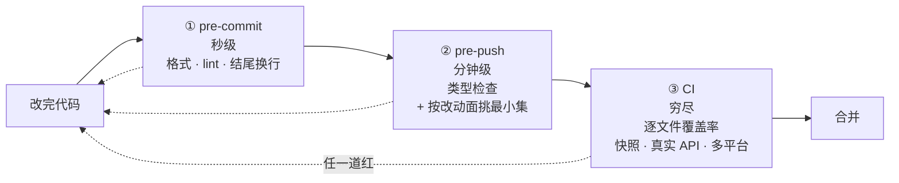

# 三、机器门禁:用检查取代信任

## 不做会怎样

AI 一晚上能产出你三天看不完的 diff。你可以要求它「提交前自己检查一遍」,它会说检查过了。但它说的和它做的是两件事,而你没有办法逐行核对。

规则写在 `AGENTS.md` 里能提高遵守率,提高不到 100%。缺的那部分,越到后期越贵。

## dsh 怎么做

能机器判断对错的规则,一律写成脚本自动跑。dsh 的 `scripts/` 目录下有大约一百个这类脚本,命名统一以 `verify-` 开头。根 `AGENTS.md` 里那句话说得很直接:

> Wire mechanically checkable invariants into an executed top-level gate.

关键词是 **executed**——写了但没被任何流程调用的检查等于不存在。

### 三道关卡,各管一段



越往后越慢也越全。快的挡低级错,慢的挡真问题。

**pre-push 刻意不跑全套。** 根 `AGENTS.md` 里的原话是「Never default to the full suite」,只挑恰好覆盖本次改动的检查,穷尽覆盖和平台矩阵交给 CI。挑选办法固化成了一个 skill:[dsh-pre-push-checks](../.agents/skills/dsh-pre-push-checks/SKILL.zh.md)。

**好在哪。** 本地全跑一遍要十几分钟,跑三次就没人愿意跑了,然后大家开始 `--no-verify`。把本地那道压到分钟级,它才会真的被执行。这个取舍有记录:[parallel-pre-push-gates](../.agents/notes/implemented/process/2026-07-06-parallel-pre-push-gates.md),里面还记了它为什么接受一个自制调度器而不用现成的任务编排工具。

### 有哪些门禁值得抄

dsh 的门禁清单和取舍在 [quality-gates](../.agents/notes/implemented/process/2026-06-11-quality-gates.md) 这篇记录里。可以直接搬的:

```
类型 / 编译零错误              决策记录格式校验
测试覆盖率(逐文件而非平均)     跨文件重复代码检测
文档死链检查                   提交信息 / 结尾换行
文档字数上限                   导出必须有文档注释
```

「文档死链检查」和「文档字数上限」这两条专门服务于前两篇讲的机制:前者保证 `AGENTS.md` 里那些链接不会烂掉,后者防止它膨胀。**机制之间是互相支撑的**——没有门禁,前两个机制会慢慢腐化。

## 两个真实的坑

### 加了门禁,但从没见它红过

一道从未失败的门禁可能只是个摆设:正则写错、路径不对,或者根本没被任何流程调用。

dsh 的 [dsh-code-review](../.agents/skills/dsh-code-review/SKILL.zh.md) 里把这条写成了审查要求:

> A guard only guards if the regression actually fails it. … add an explicit assertion, and prove it: introduce the regression, watch red, revert.

翻译过来就是:**引入回归、看它变红、再撤销**,三步做完才算这道门禁存在。

**好在哪。** 这条要求的成本是几分钟,收益是避免「我们有覆盖」这种错觉。测试策略里还举了具体场景:对一个没有 `inject` 的插件,Loader 冒烟测试在「默认导出替换了必需的具名导出」时仍然会绿——因为它压根没检查这件事。所以要额外加一条 `expect('default' in mod).toBe(false)`,并且证明它在回归时会失败。

### 把 prompt 或 schema 层的过滤当成了强制

这是最隐蔽的一种。AI 很容易写出「看起来限制住了、其实绕得过」的代码:在工具的 JSON schema 里不暴露某个字段,或者在 prompt 里叮嘱模型别那么做。

[packages/AGENTS.md](../packages/AGENTS.zh.md) 里的规则:

> **Enforce a decision in the operation that makes it.** Schema omission, prompt filtering, facades, wrappers, and listener order are not enforcement when direct or alternate callers can bypass them; test denial through the executor.

**好在哪。** 前面那篇 `vite` 的例子就是同一类问题的另一面:删掉 `package.json` 里的脚本不算修好,因为 `npx vite` 绕过脚本。判断标准是「有没有别的调用路径能到达同一个操作」,而不是「主路径上是否被拦住」。

## 覆盖率门禁的一个反直觉用法

dsh 要求 `packages/*/src` **逐文件 100%** 覆盖率,但配套的态度写在 [docs/testing.md](../docs/testing.md) 里:

> An uncovered line is often dead code the gate is correctly flagging for deletion, not a missing test to bolt on.

某行没被覆盖,先想它是不是该删,而不是急着补个测试把它盖住。

同一段还明确写了这道门禁的边界:

> Line coverage is necessary, never sufficient — it proves lines ran, not that the feature works as shipped.

**好在哪。** 同一道门禁被用来做两件事:补该补的测试,删该删的代码。而且它自己写明了不能证明什么,所以不会有人拿「覆盖率 100%」来说明功能是对的。

## 一道门禁具体长什么样

拿 [verify-agent-note-format.ts](https://github.com/deepseek-ai/deepseek-harness/blob/master/scripts/verify-agent-note-format.ts) 看,它管的正好是[第二篇](02-agent-notes.md)那套格式。不到一百行,里面有六处写法可以直接抄。

**开头先说自己不管什么。**

> Enforce Agent Note headers, lifecycle-specific sections, alternatives, and retired marker rules. Classification and filenames belong to the sibling tree gate; translation structure belongs to the pairing gate.

分类和文件名归旁边那道,翻译结构归配对那道。一句话把职责边界划完。门禁多起来之后最常见的病是三道检查里有两道半在做同一件事,而某个角落谁都没管;每道都写清「不管什么」,重叠和空隙在读的时候就能发现。

**规则常量提到文件最前面,各带一行说明。** 状态行的语法、每种生命周期的必填标题、implemented 里被禁的标题,都是顶部的命名常量。改规则的人不用读逻辑,改常量就行;读规则的人也不用把正则从 `if` 里挖出来。

**收集全部错误再一次性报,不是撞见第一个就退出。** 这条对 AI 特别重要——它会照着报错一条条改,你一次只给一条,它就得跑五轮。

**报错里带三样东西:哪个文件、违反了哪条、规则原文在哪。** 比如缺备选方案那条的报错,末尾直接写着 `see .agents/notes/README.md § The file format`。让 AI 自己去读规则,比在报错里塞一段解释更可靠,也不会出现报错和规则各说一套。

**通过的时候也打印一行,说清检查了多少个。** 源码里就一句:

```ts
console.log(`verify-agent-note-format: ${notes.length} Agent Note(s) checked, all conform to …`)
```

「检查了 696 篇,全部通过」和「通过」是两句不同的话。后者在 glob 写错、一个文件都没匹配上的时候照样会打印,而你会以为它在保护你。

**它知道自己的假阳性在哪。** 这个门禁要检查 `Status:` 这类 token,而制度文档里恰好有一堆示例代码块也含这些 token,所以它先把围栏代码块过滤掉:

> Format tokens inside fenced examples are not document structure.

新门禁最容易死在假阳性上:连报几次错都是它自己看错了,大家就开始 `--no-verify`,然后这道检查再也没红过。

### 挂在哪

dsh 用 [lefthook](https://github.com/evilmartians/lefthook) 配 git 钩子,整个 `lefthook.yml` 几十行,两个决定值得抄。

**pre-commit 的每个 job 都带 glob,只有相关文件进了暂存区才跑。** 改了 `.ts` 才跑 lint,碰了归档记录才跑归档检查。这是本地钩子能保持秒级的唯一办法——不是把检查写快,是不跑无关的。

**pre-push 只有一条:`pnpm run typecheck`。**

对,就一条。前面说「pre-push 刻意不跑全套」,落到配置里就是这么彻底:自动跑的只有增量类型检查,其余靠 [dsh-pre-push-checks](../.agents/skills/dsh-pre-push-checks/SKILL.zh.md) 按改动面挑。判断力交给 skill,钩子只留那条不管改什么都值得跑的。

还有一处小设计:生成物类的检查,dsh 的做法是**能修就别拒**。

> Regenerate rather than reject: a dependency edit that forgot the notices would otherwise fail the test lane long after the commit.

改了依赖但忘了重新生成第三方声明文件,钩子不报错,直接重新生成再 `git add`。配置里紧接着写了这招管不到的情况——删掉一个 manifest 时 glob 匹配不到任何文件,那种情况落到测试阶段去兜。一道门禁写清自己漏了什么,比假装全都覆盖了有用得多。

## 搬到自己项目

1. **先挂类型检查到 pre-push。** 收益最大、成本最低。
2. 挑一条你们反复犯的格式或结构问题,写成脚本挂 pre-commit。
3. 加决策记录的格式校验——它让第二篇讲的机制真正落地,否则记录会慢慢走形。
4. 覆盖率进 CI,先设一个现在就能过的门槛,再逐步收紧。
5. **每加一道,都先制造一次违规确认它会红。**

## 容易做错的地方

**不要把能机器判断的规则只写在文档里,要写成脚本。** 判断标准很简单:这条规则能不能用程序判断对错,能就写脚本,靠自觉一定会漏。

**不要让本地门禁慢到被绕过,要把慢的检查往后放。** 一旦有人开始用 `--no-verify`,这套东西就废了。

**不要加完门禁就当它生效了,要故意制造一次违规确认它会红。** 理由见上面那个坑。

**不要撞见第一个错就退出,要一次把全部违规报完。** AI 是照着报错改的,一次给一条,它就得跑五轮。

**不要只在失败时输出,要在通过时打印检查了多少个。** 「通过」这两个字在 glob 写错、零个文件被匹配的时候一样会出现。

---

上一篇:[决策记录](02-agent-notes.md) · 下一篇:[AI 坏习惯规范](04-bad-habits.md)
