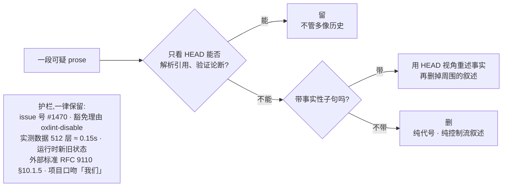

# 五、Skills:把判断固化下来

## 为什么要这么做

有些活你会反复交给 AI:审查一个 PR、清理一批文档、找出该删的代码。每次它都能干,但干法每次不一样——这次抓住了要点,下次纠结在格式上。

你可以每次都把要点重新交代一遍。但这些要点里最值钱的那部分,恰好是最难交代清楚的:**哪些地方 AI 容易做错,而且做错了当时看不出来。**

## dsh 怎么做

写成 skill 文件放进 `.agents/skills/`,每份带触发条件,AI 遇到匹配的场景自己加载。

`SKILL.md` 开头的 frontmatter 决定它什么时候被用上,比如 [dsh-code-review](../.agents/skills/dsh-code-review/SKILL.zh.md) 的:

```yaml
description: Use when reviewing a pull request in the deepseek-harness repo — orients
  the reviewer to this codebase's standards ... and the review-specific checks that
  code alone can't show
```

写得含糊,AI 就不知道什么时候该加载它,skill 等于不存在。这一行怎么写,后面单独说。

### 值钱的不是步骤

步骤谁都会写。看下来 dsh 的每个 skill 都有同一个形状:

> **一条能直接执行的判定,配一张防止做过头的护栏。**

护栏那半通常更难写,而且更容易被移植的人当成啰嗦删掉。

## 十一个 skill 各自焊死了什么

| Skill | 焊死的那条判断 | 迁移 |
|---|---|---|
| [dsh-trim-cot-leakage](../.agents/skills/dsh-trim-cot-leakage/SKILL.zh.md) | 只看 HEAD 的读者能否验证每个论断,不能就重写;附九条「什么不算泄漏」 | 直接可用 |
| [dsh-prose-standard](../.agents/skills/dsh-prose-standard/SKILL.zh.md) | 改之前先枚举这段的每条命题,逐条都留住才算改好;字数变少不算改进 | 直接可用 |
| [dsh-code-review](../.agents/skills/dsh-code-review/SKILL.zh.md) | 指南不是清单,一条有据的 blocker 胜过一堆 nits;收到审查逐条技术核实、可反驳,不要表演性同意 | 直接可用 |
| [dsh-find-simplifications](../.agents/skills/dsh-find-simplifications/SKILL.zh.md) | 动手删之前先把消费者分成生产、非生产、模糊三类看真实调用点;双适配器和双后端是有意为之 | 直接可用 |
| [dsh-merging-stacked-prs](../.agents/skills/dsh-merging-stacked-prs/SKILL.zh.md) | 栈语义交给 GitHub,不手工逐个 merge 加 retarget 去模拟;没有官方支持就停 | 直接可用 |
| [record-browser-gif](../.agents/skills/record-browser-gif/SKILL.zh.md) | GUI 改动附的 GIF 必须录自真实服务和模型流 | 直接可用 |
| [dsh-archive-agent-notes](../.agents/skills/dsh-archive-agent-notes/SKILL.zh.md) | 按未来决策价值决定归档,不按字数年龄配额;提案不归档,过时就否决 | 换命令 |
| [dsh-pre-push-checks](../.agents/skills/dsh-pre-push-checks/SKILL.zh.md) | 挑恰好覆盖改动的检查;只报告实际跑过的命令 | 换命令 |
| [dsh-doc-standards](../.agents/skills/dsh-doc-standards/SKILL.zh.md) | 一个事实一个家;字数超了先搬走、再压缩,最后才抬上限 | 换分层 |
| [dsh-translate-docs](../.agents/skills/dsh-translate-docs/SKILL.zh.md) | 双语对没有永久主语言,哪边先改哪边就是这次的作者侧 | 仅参考 |
| [dsh-doc-site-sync](../.agents/skills/dsh-doc-site-sync/SKILL.zh.md) | 站点是文档的投影,不是第二份真相 | 仅参考 |

最后两个强依赖 dsh 的双语配对机制和站点结构,当模式看就好。

## 看一个具体的:dsh-trim-cot-leakage

这是最能说明「判定 + 护栏」的一个。它治的就是[上一篇](04-bad-habits.md)第一条毛病。

### 判定

> 一个站在 HEAD、拿不到任何会话记录、PR 讨论、未提交草稿的读者,能解析每一个引用、验证每一个论断吗?
> 不能,就把幸存的事实用仓库视角重述,其余删掉。能,它就不是泄漏,不管听起来多像历史。

这句话的力气在于它把一个很虚的问题——「这句话该不该留」——换成了一个能实际执行的检验:**换一个人来读,他会不会卡住。**

那个人是:今天 `git clone` 了仓库、`checkout` 最新提交,手上只有这些文件。他没有你和 AI 的对话记录、没有 PR 评论区、没有你本地那份没提交的草稿。关键点是,**写这句话的时候这些东西对你都是唾手可得的**,所以你意识不到它们不在仓库里。

判定拆成两个动作。

**解析每一个引用** —— 提到的每个东西,他找得到吗?

`(decision 7)` 搜遍仓库什么也没有,无法解析。`#1470` 是 GitHub issue,任何时候都能打开,可以。`RFC 9110 §10.1.5` 是外部标准,天生在仓库外解析,可以。界线不是「有没有引用外部东西」,而是**这个引用在任何时候都能不能被解析**。

**验证每一个论断** —— 下的每个判断,他能自己确认真假吗?

「这样写是安全的,因为评审时确认过」——他得去翻那次评审,无法验证。「持有锁期间不会 await,所以不会重入」——对着代码就能看,可验证。

后半句「**能,它就不是泄漏,不管听起来多像历史**」是专门加的护栏。看到「旧连接先 drain,新连接才接收」这种话,容易以为是变更叙述就删掉,其实它描述的是关闭时的运行时行为,站在 HEAD 完全能验证。

### 判定不通过 ≠ 删掉

原话是「把**幸存的**事实用仓库视角重述」——「幸存」是个精确的词。一段话里常常一部分是事实、一部分是叙述,不能一起处理。下面这三条是同一个病的三种修法,一起看最清楚:

**引用有主 → 换成主人的名字和路径**

```
❌ Slash input resolves against the visible catalog (decision 21).
✅ …the plain-text-reference decision, owned by [the web input-machine note](…/2026-07-25-web-input-machine-and-slash-pipeline.md).
```

**引用没主,但带着事实 → 引用删掉,事实救出来**

```
❌ The registry rejects duplicate names (decision 7: names are flat, no namespacing).
✅ The registry rejects duplicate names; names are flat, with no namespacing.
```

仓库里没有任何东西叫 decision 7,但括号里「名字是平的、没有命名空间」是真事实。连它一起删,信息就丢了。

**整段一条事实都不带 → 直接删**

```
❌ Rendering is pure: same snapshot, same string (audit R3).
✅ Rendering is pure: same snapshot, same string.
```

### 八类泄漏

死掉的引用、栈和 PR 视角、变更叙述和版本戳、评审编排、面向评审者的自辩、复述和推导、对冲与计划残留、写作语言串味。八类各有各的修法。

其中有一招值得单独记住 —— **反事实现在时**:

```
❌ This used to double-encode multibyte labels.
✅ Without the byte-length guard, multibyte labels double-encode.
```

「以前会重复编码」改成「没有那个字节长度守卫就会重复编码」。同一个事实,换成现在时之后反而更有用了:它告诉下一个人**那个守卫为什么不能删**。原来那句只是把人送去翻 git 历史。

还有一类容易搞错方向 —— 评审编排**不是删掉,是搬家**。「评审时否掉了给 spec 加缓存」这句话本身有价值,它的家是决策记录的 Alternatives 一节;搬过去的时候把「评审者是谁、第几轮否的」去掉,只留技术理由。

八类各自的 before/after、以及在自己仓库里搜它们的 grep 探针,都在[附录](05-skills-appendix.md)里。

### 护栏:什么不算泄漏



九条保留规则里,最能说明问题的是这一对 —— 同一次无辅助的清理,一个方向删多了,另一个方向留多了。

**issue 引用在任何位置都保留,却被删了。**

```
✅ Keep: The cap applies to the complete rendered value, wrappers included
         (issue #1470 owns the follow-up).
```

删它的理由是「issue 引用该放在决策记录里」。方向反了:issue 在 HEAD 从任何位置都能解析,而「#N 负责后续」正是 README 里安放待做事项的法定写法。

**形式像「点名归属文档」,但那份文档不存在,却被留了。**

```
❌ Delete: Badge renderer over the widget seam (see the widget-rendering RFC).
```

留它的理由是「它点名了归属文档」。也错了:没有任何已提交的文件叫 "the widget-rendering RFC"。**判定是可解析性,不是形式。**

另外两条容易删错的:

**抑制警告的理由。** `oxlint-disable … -- 原因` 看着就像「面向审查者的自辩」,但它是必需的:

> Suppression justifications … are required prose; fix a false reason, never delete it.

dsh 原来那句写的是「上面的循环守卫证明了帧存在」,可那儿根本没有循环。**理由是假的就把理由改对,绝不能连注释一起删** —— 删了下一个人就不知道这里为什么关掉了检查。

**实测数据。** 「(实测:512 层嵌套 ≈ 0.15s)」这种括号注释看着像临时草稿,但:

> the provenance word "measured" is load-bearing.

「实测」这个词是承重的 —— 它说明这个常量不是拍脑袋定的。删掉之后,下一个人会以为可以随便改。

**好在哪。** 一个热心的 AI 接到「清理文档」这种任务,最容易犯的错就是删得太多:issue 号、豁免理由、实测数据一起清掉,结果文档变干净了、信息少了,而且没人发现。判定告诉它删什么,护栏告诉它哪些是承重的。**只有判定的规范是危险的规范。**

## 再看一个:dsh-prose-standard 的「完整命题」

这个 skill 管所有文字——文档、注释、prompt、报错信息。它的核心规则是改之前先把这段话里的命题列出来:

> 谁做什么 · 条件与时序 · must / may / never · 负向保证与例外 · 所有权、副作用、失败模式、后果

每条都留住,才算改好。然后是那句关键的:

> A smaller word count alone is not an improvement.

**好在哪。** AI 精简文字时最典型的损失是把 `must` 改成 `should`、把「除了 X 之外」这种例外删掉——句子更顺了,约束变松了,而且很难在 review 里被发现。要求先枚举命题,是把「顺不顺」和「全不全」拆成两件事分别判断。

这个 skill 还明确说自己**不是**一味缩短:

> This is not a one-way shortening pass. Add or restore prose when code, types, and structure do not communicate a required contract below.

该补的也要补。

## description 决定它存不存在

前面提过一句:description 写含糊,AI 判断不出何时该加载,这个 skill 就是死文件。这行值得展开,因为移植的时候它最容易被糊弄过去——正文抄得很全,description 随手写一句「代码审查规范」,然后从此没被加载过。

dsh 的十一个 description 有统一的写法:**不描述这个 skill 是什么,只描述什么时候该用它。** 全部以 `Use when` 开头,后面把触发场景尽量摊开。

摊开到什么程度?[dsh-trim-cot-leakage](../.agents/skills/dsh-trim-cot-leakage/SKILL.zh.md) 把要抓的症状短语直接列进了 description:

> dead design-session citations such as (decision N), audit item codes, or §N of uncommitted drafts; change narration such as "used to", "no longer", "this cut"; stack or review vantage …

AI 读到一段带 `used to` 的注释,不需要先理解「什么是思维链泄漏」这个抽象概念,字面匹配上就知道该加载什么。

[dsh-doc-standards](../.agents/skills/dsh-doc-standards/SKILL.zh.md) 更直接,把用户可能说的原话都抄进去了:

> … or requests like "improve the docs", "audit the docs", "where should this be documented", or "this doc is too long".

连「这文档太长了」这种大白话都在里面。写 description 的时候,把你和 AI 平时怎么开口说这件事的原话放进去,比归纳成一个精确的术语有用得多。

还有一类是反过来的:**明确不许自动加载。** [dsh-translate-docs](../.agents/skills/dsh-translate-docs/SKILL.zh.md) 的 frontmatter 是:

```yaml
disable-model-invocation: true
user-invocable: true
```

翻译这活儿成本高,而且大多数时候不该由 AI 自己决定要不要做,所以它只在用户点名叫它的时候才生效——正文第一节的标题就叫 "Invocation boundary",第一句是「只有用户显式点名时才运行」。有些流程你希望它存在,但不希望它自己启动,记得留这个开关。

### 写多长

dsh 的十一个 skill 是 45 到 146 行,中位数 81。不是刻意压的,是因为规则原文都不在 skill 里:`SKILL.md` 只写判定、护栏、工作流,细则一律链到 `AGENTS.md`、`docs/` 或者具体某篇决策记录。十一个里有五个开头就专门有一节列「该读哪些文件」,标题是 `Sources of truth` 或 `Read the contracts`;其中两个把要求直接写进了标题——`Sources of truth (read, don't re-summarize)`,别在这儿再总结一遍。

**这条约束是有原因的。** 规则在 skill 里被重述一遍,就出现了第二份真相,改规则的人不会想到还要来同步这里,于是 skill 里那份慢慢变成过期的规则,而 AI 读到的是过期那份。宁可让它多读一个文件。

真的写不下了,做法是拆 `references/`。[dsh-trim-cot-leakage](../.agents/skills/dsh-trim-cot-leakage/SKILL.zh.md) 的 `SKILL.md` 只有 45 行,大量正反例校准放在 `references/examples.md` 和 `references/recall-batteries.md`,需要时才读。判定放主文件,校准放副文件。

## 搬到自己项目

别一上来写操作手册。先问一个问题:

> **我们团队有哪条判断,是 AI 反复做错、而且做错了当时看不出来的?**

把那条写成 skill。骨架:

```markdown
---
name: <名字>
description: Use when <什么场景该用我,写清触发条件>
---

# <干什么>

**这是指南,不是清单。**

## 核心判定
> <一句话,能直接执行>

## 什么不算(护栏)
- <看似命中但必须保留的情形> —— <为什么它是承重的>

## 工作流
1. 定范围与排除
2. 先只读审计
3. 按 owner 优先修(生成物改源头)
4. 动手前枚举命题,检查过度执行
5. 验证
```

那句「这是指南,不是清单」值得照抄。dsh 的每个 skill 都写了类似的话,目的是让 AI 保持判断,而不是机械打勾——清单没覆盖到的情况,机械执行的 AI 会直接翻车。

## 容易做错的地方

**不要只抄步骤、把护栏当啰嗦删掉,要把护栏一起带走。** 这是移植 skill 最常见的错误,而且删掉之后 skill 看起来更清爽了,问题要等到 AI 过度执行时才暴露。

**不要把 description 写成「这个 skill 是什么」,要写「什么时候该用我」,并把触发的原话列进去。** AI 判断不出何时该加载,skill 就是死文件。

**不要在 skill 里重述规则原文,要链过去。** 重述出来的就是第二份真相,改规则的人想不到还要同步这里,最后 AI 读的是过期那份。

**不要写成死板清单,要明确写「这是指南,不是清单」。** 遇到清单没覆盖的情况,机械执行比不执行更糟。

---

上一篇:[AI 坏习惯规范](04-bad-habits.md) · 下一篇:[多个 AI 并行与互审](06-parallel-and-review.md)
