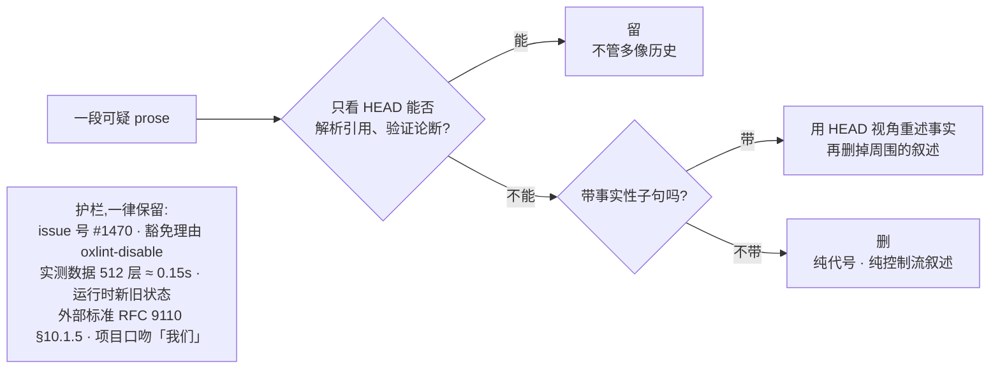

# 五、Skills:把判断固化下来

## 不做会怎样

有些活你会反复交给 AI:审查一个 PR、清理一批文档、找出该删的代码。每次它都能干,但干法每次不一样——这次抓住了要点,下次纠结在格式上。

你可以每次都把要点重新交代一遍。但这些要点里最值钱的那部分,恰好是最难交代清楚的:**哪些地方 AI 容易做错,而且做错了当时看不出来。**

## dsh 怎么做

写成 skill 文件放进 `.agents/skills/`,每份带触发条件,AI 遇到匹配的场景自己加载。

`SKILL.md` 开头的 frontmatter 决定它什么时候被用上,比如 [dsh-code-review](../.agents/skills/dsh-code-review/SKILL.md) 的:

```yaml
description: Use when reviewing a pull request in the deepseek-harness repo — orients
  the reviewer to this codebase's standards ... and the review-specific checks that
  code alone can't show
```

写得含糊,AI 就不知道什么时候该加载它,skill 等于不存在。

### 值钱的不是步骤

步骤谁都会写。看下来 dsh 的每个 skill 都有同一个形状:

> **一条能直接执行的判定,配一张防止做过头的护栏。**

护栏那半通常更难写,而且更容易被移植的人当成啰嗦删掉。

## 十一个 skill 各自焊死了什么

| Skill | 焊死的那条判断 | 迁移 |
|---|---|---|
| [dsh-trim-cot-leakage](../.agents/skills/dsh-trim-cot-leakage/SKILL.md) | 只看 HEAD 的读者能否验证每个论断,不能就重写;附九条「什么不算泄漏」 | 直接可用 |
| [dsh-prose-standard](../.agents/skills/dsh-prose-standard/SKILL.md) | 改之前先枚举这段的每条命题,逐条都留住才算改好;字数变少不算改进 | 直接可用 |
| [dsh-code-review](../.agents/skills/dsh-code-review/SKILL.md) | 指南不是清单,一条有据的 blocker 胜过一堆 nits;收到审查逐条技术核实、可反驳,不要表演性同意 | 直接可用 |
| [dsh-find-simplifications](../.agents/skills/dsh-find-simplifications/SKILL.md) | 动手删之前先把消费者分成生产、非生产、模糊三类看真实调用点;双适配器和双后端是有意为之 | 直接可用 |
| [dsh-merging-stacked-prs](../.agents/skills/dsh-merging-stacked-prs/SKILL.md) | 栈语义交给 GitHub,不手工逐个 merge 加 retarget 去模拟;没有官方支持就停 | 直接可用 |
| [record-browser-gif](../.agents/skills/record-browser-gif/SKILL.md) | GUI 改动附的 GIF 必须录自真实服务和模型流 | 直接可用 |
| [dsh-archive-agent-notes](../.agents/skills/dsh-archive-agent-notes/SKILL.md) | 按未来决策价值决定归档,不按字数年龄配额;提案不归档,过时就否决 | 换命令 |
| [dsh-pre-push-checks](../.agents/skills/dsh-pre-push-checks/SKILL.md) | 挑恰好覆盖改动的检查;只报告实际跑过的命令 | 换命令 |
| [dsh-doc-standards](../.agents/skills/dsh-doc-standards/SKILL.md) | 一个事实一个家;字数超了先搬走、再压缩,最后才抬上限 | 换分层 |
| [dsh-translate-docs](../.agents/skills/dsh-translate-docs/SKILL.md) | 双语对没有永久主语言,哪边先改哪边就是这次的作者侧 | 仅参考 |
| [dsh-doc-site-sync](../.agents/skills/dsh-doc-site-sync/SKILL.md) | 站点是文档的投影,不是第二份真相 | 仅参考 |

最后两个强依赖 dsh 的双语配对机制和站点结构,当模式看就好。

## 看一个具体的:dsh-trim-cot-leakage

这是最能说明「判定 + 护栏」的一个。它治的就是[上一篇](04-bad-habits.md)第一条毛病。

### 判定

> 一个站在 HEAD、拿不到任何会话记录、PR 讨论、未提交草稿的读者,能解析每一个引用、验证每一个论断吗?
> 不能,就把幸存的事实用仓库视角重述,其余删掉。能,它就不是泄漏,不管听起来多像历史。

注意后半句:**它明确说「能解析就留,不管听起来多像历史」**。这是在防一种过度执行——看到「旧连接先 drain,新连接才接收」这种话,以为是变更叙述就删掉,其实那是运行时行为的描述。

### 八类泄漏

死掉的设计会话引用(`(decision 7)`、阶段代号 `T4`)、栈和 PR 视角(「后面那个 PR」)、变更叙述和版本戳(`used to`、`this cut`)、评审编排(「评审时被否」)、面向 reviewer 的自辩(「这样写是安全的,因为…」)、复述和推导过程(控制流叙述)、对冲与计划残留(「暂时够用」)、写作语言串味。

每类给了各自的修法,不是一律删。比如第五类那条:

> A comment arguing its own correctness addresses a reviewer, not a maintainer. State the invariant that makes the code safe, or delete the comment if the code shows it.

一段为自己正确性辩护的注释,是在对审查者说话而不是对维护者说话。改法是**陈述那条让代码安全的不变量**——如果代码本身已经说明了,才删。

### 护栏:什么不算泄漏



九条保留规则里,有两条特别能说明问题:

**抑制警告的理由。** `oxlint-disable … -- 原因` 这种注释看着就像「面向审查者的自辩」,但它是必需的:

> Suppression justifications … are required prose; fix a false reason, never delete it.

理由写错了要改,但绝不能删——删了下一个人就不知道为什么这里关掉了检查。

**实测数据。** 「(实测:512 层嵌套 ≈ 0.15s)」这种括号注释看着像临时草稿,但:

> the provenance word "measured" is load-bearing.

「实测」这个词是承重的——它说明这个常量不是拍脑袋定的。删掉之后,下一个人会以为可以随便改。

**好在哪。** 一个热心的 AI 接到「清理文档」这种任务,最容易犯的错就是删得太多:issue 号、豁免理由、实测数据一起清掉,结果文档变干净了、信息少了,而且没人发现。判定告诉它删什么,护栏告诉它哪些是承重的。**只有判定的规范是危险的规范。**

完整的八类修法、九条保留规则、五步工作流,以及大量正反例校准:[SKILL.md](../.agents/skills/dsh-trim-cot-leakage/SKILL.md)、[examples.md](../.agents/skills/dsh-trim-cot-leakage/references/examples.md)、[recall-batteries.md](../.agents/skills/dsh-trim-cot-leakage/references/recall-batteries.md)。

## 再看一个:dsh-prose-standard 的「完整命题」

这个 skill 管所有文字——文档、注释、prompt、报错信息。它的核心规则是改之前先把这段话里的命题列出来:

> 谁做什么 · 条件与时序 · must / may / never · 负向保证与例外 · 所有权、副作用、失败模式、后果

每条都留住,才算改好。然后是那句关键的:

> A smaller word count alone is not an improvement.

**好在哪。** AI 精简文字时最典型的损失是把 `must` 改成 `should`、把「除了 X 之外」这种例外删掉——句子更顺了,约束变松了,而且很难在 review 里被发现。要求先枚举命题,是把「顺不顺」和「全不全」拆成两件事分别判断。

这个 skill 还明确说自己**不是**一味缩短:

> This is not a one-way shortening pass. Add or restore prose when code, types, and structure do not communicate a required contract below.

该补的也要补。

## 搬到自己项目

别一上来写操作手册。先问一个问题:

> **我们团队有哪条判断,是 AI 反复做错、而且做错了当时看不出来的?**

把那条写成 skill。骨架:

```markdown
---
name: <名字>
description: Use when <什么场景该用我,写清触发条件>
---

# <干什么>

**这是指南,不是清单。**

## 核心判定
> <一句话,能直接执行>

## 什么不算(护栏)
- <看似命中但必须保留的情形> —— <为什么它是承重的>

## 工作流
1. 定范围与排除
2. 先只读审计
3. 按 owner 优先修(生成物改源头)
4. 动手前枚举命题,检查过度执行
5. 验证
```

那句「这是指南,不是清单」值得照抄。dsh 的每个 skill 都写了类似的话,目的是让 AI 保持判断,而不是机械打勾——清单没覆盖到的情况,机械执行的 AI 会直接翻车。

## 容易做错的地方

**只抄步骤,把护栏当啰嗦删掉。** 这是移植 skill 最常见的错误,而且删掉之后 skill 看起来更清爽了,问题要等到 AI 过度执行的时候才暴露。

**description 写得含糊。** AI 判断不出什么时候该加载,skill 就是死文件。

**写成死板清单。** 遇到清单没覆盖的情况,机械执行比不执行更糟。

---

上一篇:[AI 坏习惯规范](04-bad-habits.md) · 下一篇:[多个 AI 并行与互审](06-parallel-and-review.md)
