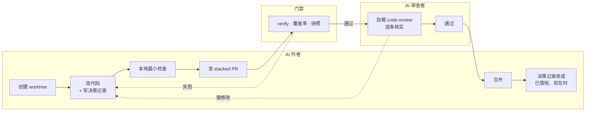

# 六、多个 AI 并行,互相审

## 不做会怎样

一个 AI 串行干活,你在等它;几个 AI 同时改同一个工作区,它们互相覆盖对方的改动。

就算并行解决了,还有第二个瓶颈:所有产出都要你审。AI 产出的速度和你审查的速度不匹配,你就成了那个卡点。

## dsh 怎么做

隔离 + 互审。



### 一、每个 AI 一个 worktree

git worktree 让同一个仓库签出多份工作目录,互不干扰。分支名带来源前缀,所以在 dsh 仓库的历史里能直接看到不同 agent 的痕迹:

```
worktree/fix-1463-rich-content-bridge
codex/fix-large-history-pagination
worktree/python-sdk-model-visible-assertions
xtr/node-pty-1.2-beta
```

**好在哪。** 这些前缀不是装饰,它是这套流程真的在跑的证据。`codex/` 和 `worktree/` 并存意味着不同厂商的 AI 在同一个仓库里并行,而且因为读的是同一份 `AGENTS.md`([第一篇](01-agents-md.md)讲的软链接),它们遵守同一套规矩。

### 二、依赖链交给 GitHub

改动 B 依赖改动 A 时,B 的 base 指向 A 的分支。这种栈的合并顺序、CI、重定基、合并状态很容易手工搞错。

[dsh-merging-stacked-prs](../.agents/skills/dsh-merging-stacked-prs/SKILL.md) 的规定很硬:

> Land dependent PRs through GitHub's native stack object and `gh stack merge`. Do not reproduce stack semantics by merging and retargeting individual PRs.

而且没有官方支持时**直接停下**,不降级成手工模拟:

> Hard-stop if the official extension or server-side stack feature is unavailable; do not fall back to manually merging and retargeting PRs one at a time.

**好在哪。** 「没有工具就手工做」听起来是负责任的做法,在这里恰好是错的——手工 retarget 一串 PR 的过程中,任何一次基线移动都可能让后面几个悄悄合并错内容。规则明确写了这种情况下停下来问人,而不是让 AI 自己扛。

这个决定的取舍记在 [native-github-stacks-and-optional-rebases](../.agents/notes/implemented/process/2026-08-02-native-github-stacks-and-optional-rebases.md)。

### 三、AI 审 AI

审查者 AI 加载 [dsh-code-review](../.agents/skills/dsh-code-review/SKILL.md),拿整套仓库标准来审。这个 skill 的基调第一句就定了:

> **This skill is guidance, not a complete checklist.** … a short review with one substantiated blocker is better than a list of nits.

**一条有据的 blocker 胜过一堆 nits。** 这句是针对 AI 审查的典型失败模式写的——AI 很容易挑出二十条格式问题,却漏掉那个真正的并发 bug。

它列了六条硬性 blocking 项,其中两条特别有意思:

**测试强度那条。** 要求断言必须能在预期的回归上失败,而且:

> verify external state, logs, events, or disposal rather than restating the implementation or trusting an agent's report.

不要相信 agent 的报告——审查规则里直接把这条写进去了,和[第四篇](04-bad-habits.md)那条「测世界别测自我报告」是同一件事的两个位置:一个约束写测试的人,一个约束审查的人。

**反向嗅探。** 一般的审查关注「有没有漏掉抽象」,这条反过来:

> a new public method on a generic service whose only caller is one internal consumer is an unnecessary API expansion — require a private capability closure handed to that consumer at construction instead.

一个通用服务上新增的公开方法,如果唯一调用者是某个内部消费者,那是不必要的 API 膨胀。AI 很爱加这种「顺手做通用一点」的方法。

### 四、收到审查意见时不许附和

skill 的最后一句:

> When receiving review, verify each claim and fix or rebut it on technical grounds without performative agreement.

**好在哪。** 这是 AI 互审最容易退化的地方。两个都倾向于顺着对方说的 AI 互审,产出的是一堆「您说得对,我改」,等于没审。明确要求「逐条核实,可以技术反驳」,才让这道关卡有意义。

### 五、合并即回填记忆

PR 实现了某篇提案,同一次改动里要把那篇记录从提案改写成已落地的现在时。这也是审查的 blocking 项之一:

> when a PR implements a proposed Agent Note, move and rewrite it as present-tense shipped state in the same diff, then verify paths, names, and mechanisms against the implementation.

**好在哪。** 记录和现实脱节是[第二篇](02-agent-notes.md)那套机制最主要的腐化方式。把「改写记录」绑进合并前的检查项,腐化就不会攒起来。

## 搬到自己项目

这一步的收益和团队规模相关,单人单 AI 时管理成本大于收益。规模上来了再上:

1. 每个 AI 一个 worktree,分支带来源前缀。
2. 依赖链用平台的官方栈功能;没有就拆成独立 PR,别手工模拟。
3. 审查者 AI 加载审查 skill;明确要求「一条有据的 blocker 胜过一堆 nits」和「不许表演性同意」。
4. 把「回填决策记录」写进合并前检查项。

## 容易做错的地方

**不要让多个 AI 共享一个工作区,要一人一个 worktree。** 共享就会互相覆盖,而且很难发现是谁覆盖的。

**不要容忍审查者 AI 一味附和,要在规则里写明可以技术反驳。** 一片「您说得对」等于没审。

**不要让审查停在 nit 上,要在 skill 里显式排序。** AI 审查天然偏向格式问题,因为那些好找。把正确性、生命周期、安全、被破坏的必需行为都排在风格之前。

---

上一篇:[Skills](05-skills.md) · 下一篇:[怎么开始](07-adoption.md)
